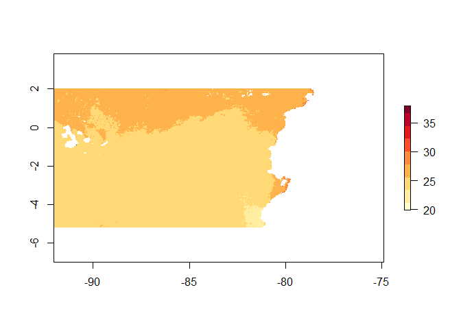
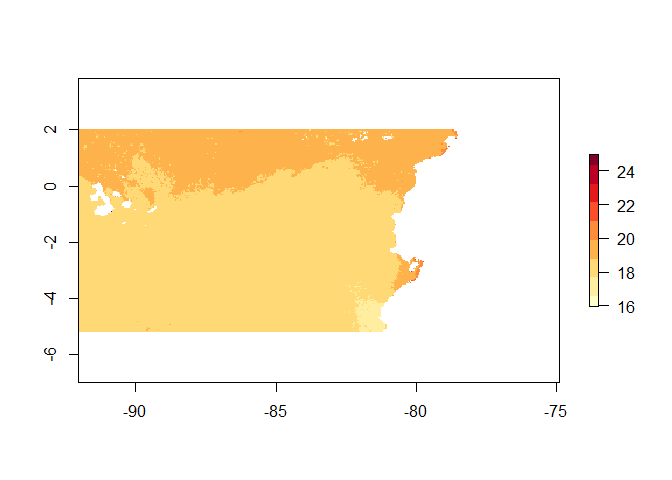
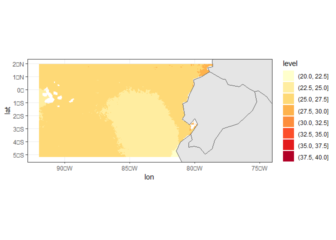

Datos espaciales en R
================
Denisse Fierro Arcos
2023-02-17

- <a href="#analisis-de-datos-espaciales-en-r"
  id="toc-analisis-de-datos-espaciales-en-r">Analisis de datos espaciales
  en <code>R</code></a>
  - <a href="#llamando-paquetes-relevantes"
    id="toc-llamando-paquetes-relevantes">Llamando paquetes relevantes</a>
  - <a href="#buscando-y-bajando-datos-de-la-noaa"
    id="toc-buscando-y-bajando-datos-de-la-noaa">Buscando y bajando datos de
    la NOAA</a>
  - <a href="#graficando-datos" id="toc-graficando-datos">Graficando
    datos</a>

# Analisis de datos espaciales en `R`

Aqui describimos como acceder a datos en formato raster disponibles de
manera libre de la NOAA a traves del servidor
[ERDDAP](https://coastwatch.pfeg.noaa.gov/erddap/index.html) utilizando
el paquete `rerddap`.

Tambien cubriremos como crear mapas utilizando datos tipo raster y
poligonos utilizando las librerias `sf` y `ggplot2`.

## Llamando paquetes relevantes

``` r
library(tidyverse) #Incluye a ggplot2
```

    ## ── Attaching packages ─────────────────────────────────────── tidyverse 1.3.2 ──
    ## ✔ ggplot2 3.4.0     ✔ purrr   1.0.1
    ## ✔ tibble  3.1.8     ✔ dplyr   1.1.0
    ## ✔ tidyr   1.3.0     ✔ stringr 1.5.0
    ## ✔ readr   2.1.2     ✔ forcats 0.5.2
    ## ── Conflicts ────────────────────────────────────────── tidyverse_conflicts() ──
    ## ✖ dplyr::filter() masks stats::filter()
    ## ✖ dplyr::lag()    masks stats::lag()

``` r
library(rerddap)
```

    ## Registered S3 method overwritten by 'hoardr':
    ##   method           from
    ##   print.cache_info httr

``` r
library(raster)
```

    ## Loading required package: sp
    ## 
    ## Attaching package: 'raster'
    ## 
    ## The following object is masked from 'package:dplyr':
    ## 
    ##     select

## Buscando y bajando datos de la NOAA

Primero debemos buscar los servidores que estan disponibles para nuestra
busqueda. La funcion `servers()` de `rerddap` nos devuelve una lista de
servidores que podemos acceder.

``` r
servidores <- servers()
#Revisemos las primeras opciones disponibles
head(servidores)
```

    ## # A tibble: 6 × 4
    ##   name                                                      short…¹ url   public
    ##   <chr>                                                     <chr>   <chr> <lgl> 
    ## 1 CoastWatch West Coast Node                                CSWC    http… TRUE  
    ## 2 ERDDAP at the Asia-Pacific Data-Research Center           APDRC   http… TRUE  
    ## 3 NOAA's National Centers for Environmental Information (N… NCEI    http… TRUE  
    ## 4 Biological and Chemical Oceanography Data Management Off… BCODMO  http… TRUE  
    ## 5 European Marine Observation and Data Network (EMODnet) P… EMODnet http… TRUE  
    ## 6 Marine Institute - Ireland                                MII     http… TRUE  
    ## # … with abbreviated variable name ¹​short_name

Podemos ver que la NOAA esta incluida en nuestra lista, pero estamos
interesados en Coastwatch especificamente. Podemos hacer una busqueda
utilizando el `tidyverse`

``` r
servidores %>%
  filter(str_detect(str_to_lower(name), "coastwatch"))
```

    ## # A tibble: 4 × 4
    ##   name                                     short_name url                 public
    ##   <chr>                                    <chr>      <chr>               <lgl> 
    ## 1 CoastWatch West Coast Node               CSWC       https://coastwatch… TRUE  
    ## 2 CoastWatch Caribbean/Gulf of Mexico Node CSCGOM     https://cwcgom.aom… TRUE  
    ## 3 NOAA CoastWatch Great Lakes Node         GLERL      https://coastwatch… TRUE  
    ## 4 NOAA CoastWatch Central Operations       NCCO       https://coastwatch… TRUE

Para este ejemplo usaremos Coastwatch West Coast Node (CSWC). Guardemos
el URL en un una variable.

``` r
coastwatch_url <- servidores %>% 
  #Ahora que sabemos el nombre corto, podemos utilizar esto para filtrar los servidores
  filter(short_name == "CSWC") %>% 
  pull(url)

#Veamos el resultado
coastwatch_url
```

    ## [1] "https://coastwatch.pfeg.noaa.gov/erddap/"

Podemos hacer una busqueda sencilla de datos de temperatura de la
superficie del mar (SST por sus siglas en ingles) usando la funcion
`ed_search`.

``` r
temp_sup_res <- ed_search(query = "SST", 
          which = "griddap",
          url = coastwatch_url)

#Veamos los primeros resultados
head(temp_sup_res$info)
```

    ##                                                                                 title
    ## 1          HadISST Average Sea Surface Temperature, 1°, Global, Monthly, 1870-present
    ## 2 HadISST Average Sea Surface Temperature, 1°, Global, Monthly, 1870-present, Lon0360
    ## 3                        HadISST Sea Ice Component, 1°, Global, Monthly, 1870-present
    ## 4               HadISST Sea Ice Component, 1°, Global, Monthly, 1870-present, Lon0360
    ## 5                         NOAA ERSSTv4 (in situ only), 2°, Global, Monthly, 1854-2020
    ## 6              NOAA ERSSTv4 (in situ only), 2°, Global, Monthly, 1854-2020, Lon+/-180
    ##              dataset_id
    ## 1            erdHadISST
    ## 2    erdHadISST_Lon0360
    ## 3         erdHadISSTIce
    ## 4 erdHadISSTIce_Lon0360
    ## 5           nceiErsstv4
    ## 6  nceiErsstv4_LonPM180

Tenemos varias opciones disponibles. Podemos revisar mas informacion
sobre el dataset de nuestro interes con `info`.

``` r
info(temp_sup_res$info$dataset_id[1])
```

    ## <ERDDAP info> erdHadISST 
    ##  Base URL: https://upwell.pfeg.noaa.gov/erddap 
    ##  Dataset Type: griddap 
    ##  Dimensions (range):  
    ##      time: (1870-01-16T11:59:59Z, 2022-09-16T12:00:00Z) 
    ##      latitude: (-89.5, 89.5) 
    ##      longitude: (-179.5, 179.5) 
    ##  Variables:  
    ##      sst: 
    ##          Units: C

Con la funcion `ed_search_adv()` podemos hacer una busqueda mas
especifica que nos da resultados mas relevantes. Supongamos que queremos
datos de Ecuador

``` r
temp_sup_res <- ed_search_adv(query = "SST",
              #Datos en grilla
              protocol = "griddap",
              #Servidor CSWC
              url = coastwatch_url,
              #Datos mensuales
              keywords = "monthly",
              #Limites espaciales
              maxLat = 2,
              minLat = -5.2,
              maxLon = -74.9,
              minLon = -92,
              #Limites temporales
              minTime = "2010",
              maxTime = "2020-06")

head(temp_sup_res$info)
```

    ## # A tibble: 6 × 2
    ##   title                                                                  datas…¹
    ##   <chr>                                                                  <chr>  
    ## 1 HadISST Average Sea Surface Temperature, 1°, Global, Monthly, 1870-pr… erdHad…
    ## 2 HadISST Sea Ice Component, 1°, Global, Monthly, 1870-present           erdHad…
    ## 3 SST and SST Anomaly, NOAA Global Coral Bleaching Monitoring, 5km, V.3… NOAA_D…
    ## 4 SST, AQUA_MODIS, L3m.MO.SST.sst.4km, Masked, SMI, NASA GSFC OBPG, R20… erdMH1…
    ## 5 SST, AQUA_MODIS, L3m.MO.SST.sst.4km.NRT, Masked, SMI, NASA GSFC OBPG,… erdMH1…
    ## 6 SST, AQUA_MODIS, Masked, R2022 SQ, NASA GSFC OBPG, Global, 0.04166°, … erdMH1…
    ## # … with abbreviated variable name ¹​dataset_id

Revisemos los datos en mas detalle.

``` r
info(temp_sup_res$info$dataset_id[15])
```

    ## <ERDDAP info> erdMH1sstdmday 
    ##  Base URL: https://upwell.pfeg.noaa.gov/erddap 
    ##  Dataset Type: griddap 
    ##  Dimensions (range):  
    ##      time: (2003-01-16T00:00:00Z, 2019-10-16T00:00:00Z) 
    ##      latitude: (-89.97918, 89.97916) 
    ##      longitude: (-179.9792, 179.9792) 
    ##  Variables:  
    ##      sst: 
    ##          Units: degree_C

Encontramos los datos que necesitamos. Ahora los bajamos a nuestro
disco.

``` r
temp_sup_ecu <- griddap(temp_sup_res$info$dataset_id[15],
                        #Limites temporales
                        time = c("2010-01-01", "2010-12-31"),
                        #Limites espaciales
                        latitude = c(-5.2, 2),
                        longitude = c(-92, -74.9),
                        #Acceder a la informacion en formato netcdf
                        fmt = "nc",
                        #Guardar informacion en disco
                        store = disk(path = "Data/"))

#Esta opcion tambien guarda los datos en la variable
temp_sup_ecu
```

    ## <ERDDAP griddap> erdMH1sstdmday
    ##    Path: [Data//67632e6317d74225c2716f0f14779bb7.nc]
    ##    Last updated: [2023-02-17 16:02:40]
    ##    File size:    [3.45 mb]
    ##    Dimensions (dims/vars):   [3 X 1]
    ##    Dim names: time, latitude, longitude
    ##    Variable names: Masked Daytime Sea Surface Temperature
    ##    data.frame (rows/columns):   [860256 X 4]
    ## # A tibble: 860,256 × 4
    ##    time                   lat   lon   sst
    ##    <chr>                <dbl> <dbl> <dbl>
    ##  1 2010-01-16T00:00:00Z  2.02 -92.0  26.5
    ##  2 2010-01-16T00:00:00Z  2.02 -92.0  26.4
    ##  3 2010-01-16T00:00:00Z  2.02 -91.9  26.6
    ##  4 2010-01-16T00:00:00Z  2.02 -91.9  26.6
    ##  5 2010-01-16T00:00:00Z  2.02 -91.9  26.7
    ##  6 2010-01-16T00:00:00Z  2.02 -91.8  26.7
    ##  7 2010-01-16T00:00:00Z  2.02 -91.8  26.8
    ##  8 2010-01-16T00:00:00Z  2.02 -91.7  26.5
    ##  9 2010-01-16T00:00:00Z  2.02 -91.7  26.1
    ## 10 2010-01-16T00:00:00Z  2.02 -91.6  26.4
    ## # … with 860,246 more rows

Revisemos los archivos que acabamos de guardar en el disco.

``` r
archivo <- list.files("Data/", full.names = T)
archivo
```

    ## [1] "Data/67632e6317d74225c2716f0f14779bb7.nc"

## Graficando datos

Tenemos primero que subir los datos a nuestra sesion.

``` r
temp_sup_ec <- raster(archivo)
temp_sup_ec
```

    ## class      : RasterLayer 
    ## band       : 1  (of  12  bands)
    ## dimensions : 174, 412, 71688  (nrow, ncol, ncell)
    ## resolution : 0.04166667, 0.04166668  (x, y)
    ## extent     : -92.04166, -74.875, -5.208338, 2.041664  (xmin, xmax, ymin, ymax)
    ## crs        : +proj=longlat +datum=WGS84 +no_defs 
    ## source     : 67632e6317d74225c2716f0f14779bb7.nc 
    ## names      : Masked.Daytime.Sea.Surface.Temperature 
    ## z-value    : 2010-01-16 
    ## zvar       : sst

Este archivo tiene 12 bandas, una por cada mes en el anio. Revisemos el
primer mes.

``` r
raster::plot(temp_sup_ec[[1]], col = RColorBrewer::brewer.pal(9, "YlOrRd"))
```

<!-- -->
Podemos calcular el promedio anual y graficar los resultados.

``` r
#Promedio
temp_prom_anual <- raster::mean(temp_sup_ec, 12)
#Graficando
raster::plot(temp_prom_anual, col = RColorBrewer::brewer.pal(9, "YlOrRd"))
```

<!-- -->
Podemos tambien hacer uso de la variable que contiene los datos.
Utilicemos esta opcion junto con `ggplot2` y agreguemos una capa del
mundo.

``` r
#Calculando el promedio de temperatura durante la epoca fria
temp_fria <- temp_sup_ecu$data %>% 
  #Escogemos los meses de la epoca fria
  filter(lubridate::month(time) <= 4 | lubridate::month(time) == 12) %>% 
  #Agrupamos por latitud y longitud
  group_by(lat, lon) %>% 
  #Calculamos el promedio
  summarise(temp_prom = mean(sst, na.rm = T))
```

    ## `summarise()` has grouped output by 'lat'. You can override using the `.groups`
    ## argument.

Ahora podemos graficar este promedio.

``` r
#Capa de continentes
tierra <- rnaturalearth::ne_countries(returnclass = "sf")

#Grafiquemos
temp_fria %>% 
  ggplot(aes(x = lon, y = lat))+
  geom_contour_filled(aes(z = temp_prom), binwidth = 2.5)+
  scale_fill_brewer(palette = "YlOrRd")+
  geom_sf(data = tierra, inherit.aes = F)+
  lims(x = c(-92, -74.9), y = c(-5.2, 2))+
  theme_bw()
```

    ## Warning: Removed 23522 rows containing non-finite values
    ## (`stat_contour_filled()`).

<!-- -->
