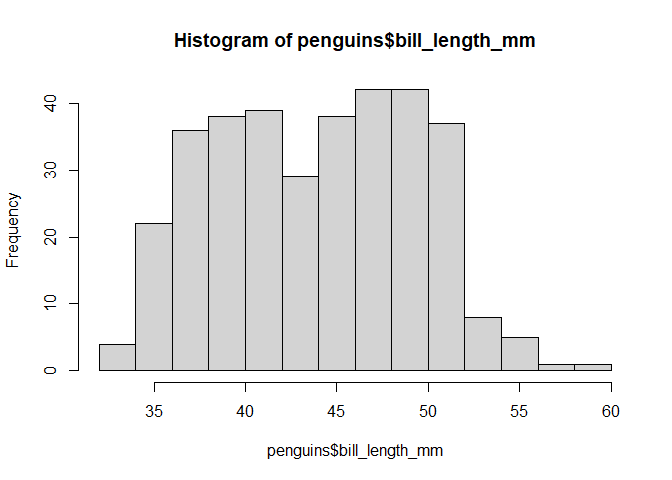
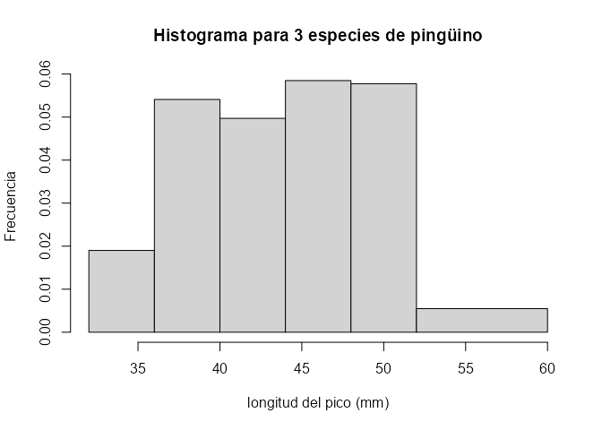
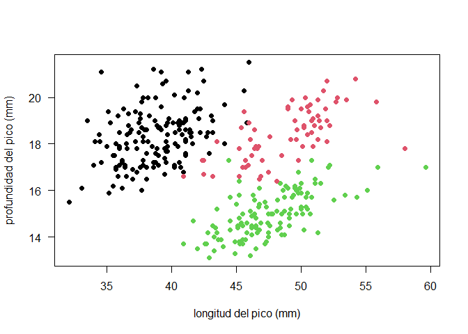
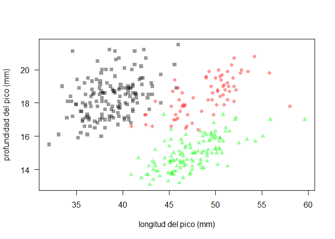
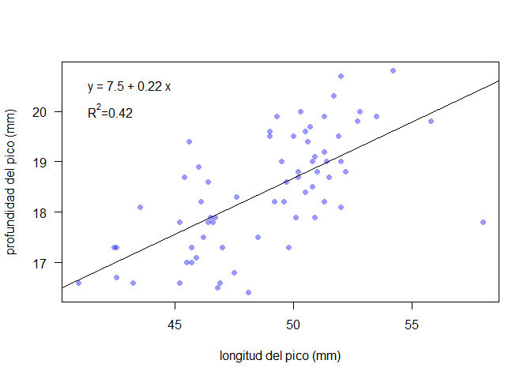
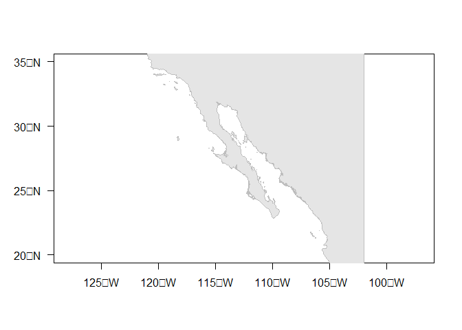
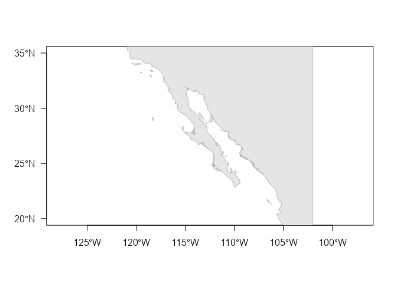
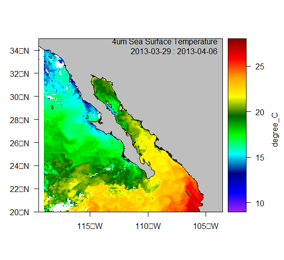
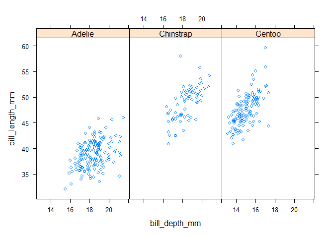

Visualización en R
================
Héctor Villalobos

- <a href="#gráficas-tradicionales"
  id="toc-gráficas-tradicionales">Gráficas tradicionales</a>
  - <a href="#histogramas" id="toc-histogramas">Histogramas</a>
  - <a href="#gráficas-de-cajas-y-bigotes"
    id="toc-gráficas-de-cajas-y-bigotes">Gráficas de cajas y bigotes</a>
  - <a href="#gráficas-de-dispersión"
    id="toc-gráficas-de-dispersión">Gráficas de dispersión</a>
  - <a href="#especialidades" id="toc-especialidades">Especialidades</a>
- <a href="#gráficas-grid" id="toc-gráficas-grid">Gráficas grid</a>
  - <a href="#lattice" id="toc-lattice">Lattice</a>
  - <a href="#ggplot2" id="toc-ggplot2">ggplot2</a>

En R existen dos sistemas gráficos principales, el tradicional o básico
(*base graphics*), similar al sistema original del lenguaje S y un nuevo
sistema único de R, denominado *grid graphics*. En este charla se hará
énfasis en el primero, aunque se presentarán algunos ejemplos del
segundo.

## Gráficas tradicionales

Las gráficas tradicionales, **ejemplificadas en el material del aula
invertida**, constan de funciones que producen gráficas estadísticas
completas (histogramas, cajas y bigotes, diagramas de dispersión, etc.)
o que permiten agregar diversos elementos a estas.

Para ilustrar algunas de las gráficas más comunes usaremos datos de tres
especies de pingüinos del paquete **palmerpenguins**.

``` r
# Datos de pingüinos del archipiélago Palmer
library(palmerpenguins)
data(penguins)
head(penguins)
```

    # A tibble: 6 × 8
      species island    bill_length_mm bill_depth_mm flipper_l…¹ body_…² sex    year
      <fct>   <fct>              <dbl>         <dbl>       <int>   <int> <fct> <int>
    1 Adelie  Torgersen           39.1          18.7         181    3750 male   2007
    2 Adelie  Torgersen           39.5          17.4         186    3800 fema…  2007
    3 Adelie  Torgersen           40.3          18           195    3250 fema…  2007
    4 Adelie  Torgersen           NA            NA            NA      NA <NA>   2007
    5 Adelie  Torgersen           36.7          19.3         193    3450 fema…  2007
    6 Adelie  Torgersen           39.3          20.6         190    3650 male   2007
    # … with abbreviated variable names ¹​flipper_length_mm, ²​body_mass_g

Con la instrucción `?palmerpenguins` se pueden ver los detalles de estos
datos.

### Histogramas

Los histogramas permiten ver la distribución de una variable. La función
`hist()` requiere especificar únicamente el nombre de la variable de
interés, mientras que los intervalos (número y límites) son determinados
de manera automática, al igual que la escala de los ejes, sus etiquetas
y título principal.

``` r
hist(penguins$bill_length_mm)
```



Muchos de estos elementos se pueden personalizar a través de argumentos
de la función `hist()`. Por ejemplo el título (`main`), las etiquetas de
los ejes (`xlab`, `ylab`), y los límites de los intervalos (`breaks`).

``` r
hist(penguins$bill_length_mm, xlab = "longitud del pico (mm)", ylab = "Frecuencia",
     main = "Histograma para 3 especies de pingüino", 
     breaks = seq(32, 60, 4))
```


### Gráficas de cajas y bigotes

El *boxplot* también da una idea de la distribución de una variable, en
este caso para cada una de las tres especies de pingüino, lo cual se
especifica con la tilde o virgulilla (`~`) y se lee “longitud del pico
**en función** de la especie”. Adicionalmente esta función incorpora el
argumento `data` que permite especificar en donde están las variables a
graficar. Las etiquetas de los ejes se pueden personalizar con los
mismos argumentos mostrados antes.

``` r
boxplot(bill_length_mm ~ species, data = penguins)
```



### Gráficas de dispersión

En el caso de dos variables se pueden crear gráficas de dispersión
especificando en que eje va cada variable. Si esto no se indica, la
primera se considera como la variable `x`.

``` r
plot(x = penguins$bill_length_mm, y = penguins$bill_depth_mm)
```


Personalización

``` r
plot(penguins$bill_length_mm, penguins$bill_depth_mm,
     xlab = "longitud del pico (mm)", ylab = "profundidad del pico (mm)",
     las = 1, pch = 16, col = penguins$species)
```



Este resultado pueden refinarse

``` r
plot(penguins$bill_length_mm, penguins$bill_depth_mm, type = "n", las = 1,
     xlab = "longitud del pico (mm)", ylab = "profundidad del pico (mm)")
points(penguins$bill_length_mm[penguins$species == "Adelie"],
       penguins$bill_depth_mm[penguins$species == "Adelie"], pch = 16, 
       col = rgb(0, 0, 0, 0.4))
points(penguins$bill_length_mm[penguins$species == "Gentoo"],
       penguins$bill_depth_mm[penguins$species == "Gentoo"], pch = 16, 
       col = rgb(0, 1, 0, 0.4))
points(penguins$bill_length_mm[penguins$species == "Chinstrap"],
       penguins$bill_depth_mm[penguins$species == "Chinstrap"], pch = 16, 
       col = rgb(1, 0, 0, 0.4))
```



### Especialidades

#### Mapas

``` r
library(satin)
library(maptools)
```

    Loading required package: sp


    Attaching package: 'sp'

    The following object is masked from 'package:satin':

        imageScale

    Checking rgeos availability: TRUE
    Please note that 'maptools' will be retired during 2023,
    plan transition at your earliest convenience;
    some functionality will be moved to 'sp'.

``` r
data(dmap)
plot(dmap, axes = TRUE, xlim = c(-120, -105), ylim = c(20, 35), las = 1, 
     col = "grey90", border = "grey")
```



#### Gráficas interactivas

#### Ecogramas

``` r
library(echogram)
hacfile <- system.file("extdata", "D20150510-T202500.hac", package = "echogram")
echo2.038 <- read.echogram(hacfile)
echogram(echo2.038, Svthr = -70, col.sep = 1.5, scheme = "EK500")
```



#### Imágenes de satélite

``` r
library(satin)
data("dsst")
plot(dsst, map = dmap)
```



## Gráficas grid

El paquete grid proporciona funciones de bajo nivel para producir
líneas, polígonos, texto, símbolos, etc. Existen dos paquetes que hacen
uso de estas funciones de bajo nivel para generar resultados completos.

### Lattice

``` r
library(lattice)
xyplot(bill_length_mm ~ bill_depth_mm | species, data = penguins)
```



### ggplot2

``` r
library(ggplot2)
p <- ggplot(data = penguins, 
            aes(x = bill_length_mm, y = bill_depth_mm, colour = species)) +
     geom_point()
p
```

    Warning: Removed 2 rows containing missing values (`geom_point()`).


