Visualización en R
================
Héctor Villalobos
22/2/23

- <a href="#gráficas-tradicionales"
  id="toc-gráficas-tradicionales">Gráficas tradicionales</a>
  - <a href="#histogramas" id="toc-histogramas">Histogramas</a>
  - <a href="#gráficas-de-cajas-y-bigotes"
    id="toc-gráficas-de-cajas-y-bigotes">Gráficas de cajas y bigotes</a>
  - <a href="#gráficas-de-dispersión"
    id="toc-gráficas-de-dispersión">Gráficas de dispersión</a>
  - <a href="#gráficos-especializados"
    id="toc-gráficos-especializados">Gráficos especializados</a>
- <a href="#gráficas-grid" id="toc-gráficas-grid">Gráficas grid</a>
  - <a href="#lattice" id="toc-lattice">Lattice</a>
  - <a href="#ggplot2" id="toc-ggplot2">ggplot2</a>

En R existen dos sistemas gráficos principales, el tradicional o básico
(*base graphics*), similar al original del lenguaje S y un sistema único
de R, denominado *grid graphics* en el que se basan paquetes como
**lattice** y **ggplot2**. Aquí haremos énfasis en el sistema
tradicional, aunque se presentarán algunos ejemplos de los paquetes
mencionados.

## Gráficas tradicionales

Las gráficas tradicionales, **ejemplificadas en el material del aula
invertida**, constan de funciones que producen gráficas estadísticas
completas (histogramas, cajas y bigotes, diagramas de dispersión, etc.)
o que permiten agregar diversos elementos a estas.

Para ilustrar algunas de las gráficas más comunes usaremos datos de tres
especies de pingüinos disponibles en el paquete **palmerpenguins**.

``` r
# Datos de pingüinos del archipiélago Palmer
library(palmerpenguins)
data(penguins)
head(penguins)
```

    # A tibble: 6 × 8
      species island    bill_length_mm bill_depth_mm flipper_l…¹ body_…² sex    year
      <fct>   <fct>              <dbl>         <dbl>       <int>   <int> <fct> <int>
    1 Adelie  Torgersen           39.1          18.7         181    3750 male   2007
    2 Adelie  Torgersen           39.5          17.4         186    3800 fema…  2007
    3 Adelie  Torgersen           40.3          18           195    3250 fema…  2007
    4 Adelie  Torgersen           NA            NA            NA      NA <NA>   2007
    5 Adelie  Torgersen           36.7          19.3         193    3450 fema…  2007
    6 Adelie  Torgersen           39.3          20.6         190    3650 male   2007
    # … with abbreviated variable names ¹​flipper_length_mm, ²​body_mass_g

Con la instrucción `?palmerpenguins` se pueden consultar los detalles de
esta base de datos.

### Histogramas

Los histogramas permiten ver la distribución de una variable numérica.
La función `hist()` requiere especificar únicamente el nombre de la
variable de interés, mientras que el número y límites de los intervalos
son determinados de manera automática, al igual que las escalas de los
ejes y sus etiquetas, y título principal.

``` r
hist(penguins$bill_length_mm)
```

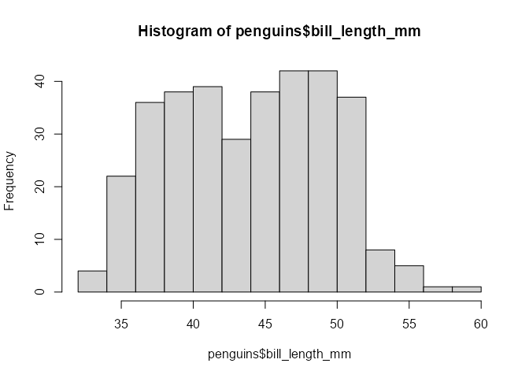

Muchos de estos elementos se pueden personalizar a través de argumentos
de la función `hist()`. Por ejemplo el título (`main`), los nombres de
los ejes (`xlab`, `ylab`), y los límites de los intervalos (`breaks`).

``` r
hist(penguins$bill_length_mm, xlab = "longitud del pico (mm)", ylab = "Frecuencia",
     main = "Histograma para 3 especies de pingüino", 
     breaks = c(seq(32, 52, 4), 60))
```

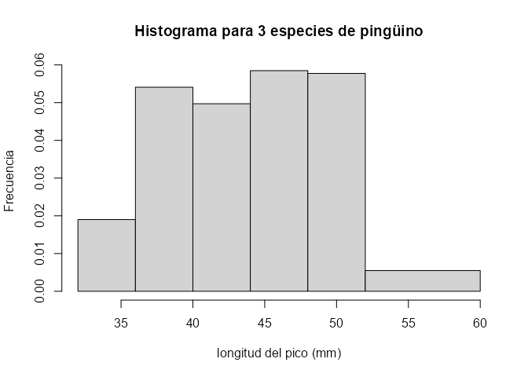

Como puede verse, la formación de los intervalos es muy flexible (ver el
valor del argumento `breaks`).

### Gráficas de cajas y bigotes

El *boxplot* también da una idea de la distribución de una variable
numérica, en este caso para cada una de las tres especies de pingüino,
lo cual se especifica con la tilde o virgulilla (`~`) y se lee “longitud
del pico **en función** de la especie”. Adicionalmente, esta función
incorpora el argumento `data` que permite especificar en donde están las
variables a graficar. Los nombres de los ejes se pueden personalizar con
los mismos argumentos mostrados antes.

``` r
boxplot(bill_length_mm ~ species, data = penguins)
```

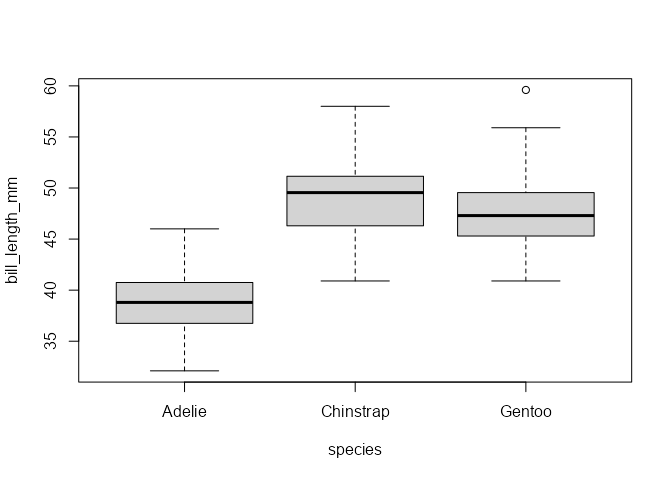

### Gráficas de dispersión

En el caso de dos variables se pueden crear gráficas de dispersión
especificando en que eje va cada variable. Si esto no se indica, la
primera se considera como la variable `x`.

``` r
plot(x = penguins$bill_length_mm, y = penguins$bill_depth_mm)
```

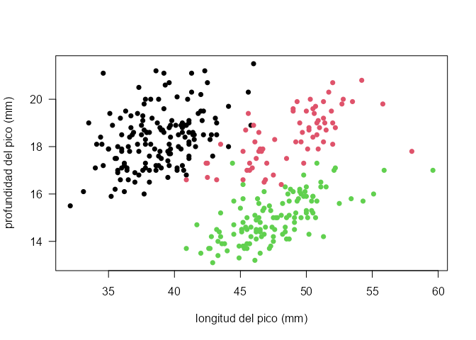

Existen muchas maneras de personalizar una gráfica como la anterior. Por
ejemplo, sabiendo que se tienen datos de tres especies, podemos utilizar
colores diferentes para cada una.

``` r
plot(penguins$bill_length_mm, penguins$bill_depth_mm,
     xlab = "longitud del pico (mm)", ylab = "profundidad del pico (mm)",
     las = 1, pch = 16, col = penguins$species)
```

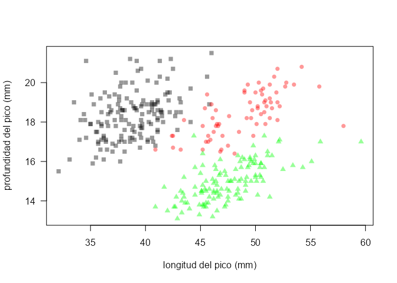

El uso de `col = penguins$species` permite definir los colores porque la
especie esta codificada como un factor (ver el resultado de evaluar
`class(penguins$species)`). Otros argumentos usados en el ejemplo
anterior son el tipo de símbolo (`pch = 16`), que en este caso es un
círculo relleno. En la ayuda de la función `points()` se pueden ver
otros símbolos disponibles. Por último, el argumento `las = 1` opera en
las etiquetas de los ejes, mostrándolas de manera horizontal en este
caso.

Otra forma de personalizar la figura podría ser incorporando
transparencias a los colores y símbolos diferentes por especie. Para
ello el ejemplo de abajo hace uso de la función `rgb()` que requiere
especificar 3 valores correspondientes al rojo, verde y azul, así como
un cuarto valor para la transparencia (todos entre 0 y 1).

``` r
sp <- levels(penguins$species)
rojo <- c(0, 1, 0); verde <- c(0, 0, 1); azul <- c(0, 0, 0); alfa <- 0.4

plot(penguins$bill_length_mm, penguins$bill_depth_mm, type = "n", las = 1,
     xlab = "longitud del pico (mm)", ylab = "profundidad del pico (mm)")
 for (i in 1:3) {
  points(penguins$bill_length_mm[penguins$species == sp[i]],
         penguins$bill_depth_mm[penguins$species == sp[i]], pch = i + 14, 
         col = rgb(rojo[i], verde[i], azul[i], alfa))  
 }
```

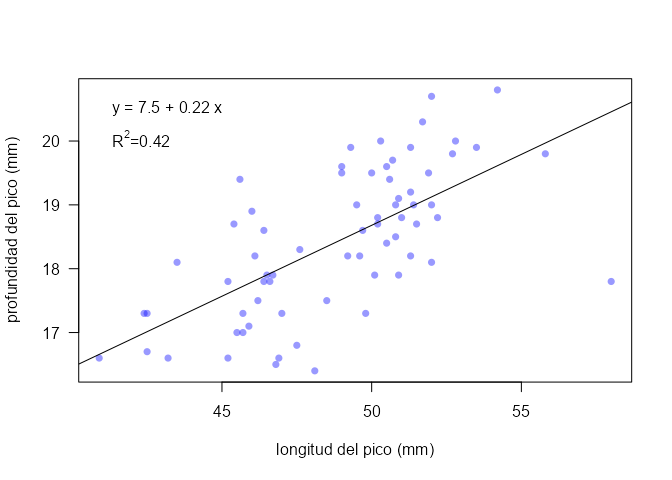

En el código previo, el llamado a la función `plot()` solo genera el
marco del gráfico y los ejes, pero no dibuja ningún punto
(`type = "n"`), puesto que de ello se encarga la función `points()` en
donde se especifican la especie, colores y símbolos a utilizar. Este
ejemplo también hace uso de un bucle para dibujar sucesivamente los
puntos de cada especie, así como el tipo de símbolo y los diferentes
niveles de rojo, verde y azul en estos.

Un ejemplo más para ilustrar como podemos agregar otros elementos como
líneas de tendencia y anotaciones (texto) en la gráfico es el siguiente:

``` r
chin <- subset(penguins, species == "Chinstrap")
plot(chin$bill_length_mm, chin$bill_depth_mm, las = 1, pch = 16,
     xlab = "longitud del pico (mm)", ylab = "profundidad del pico (mm)",
     col = rgb(0, 0, 1, 0.4))
  abline(lm(bill_depth_mm ~ bill_length_mm, data = chin))
  text(x = 41, y = 20.5, "y = 7.5 + 0.22 x", pos = 4)
  text(x = 41, y = 20, pos = 4, expression(paste(R^2, "=0.42")))
```

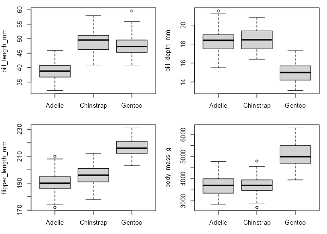

Aquí utilizamos un subconjunto de los datos para la especie “Chinstrap”,
para la cual dibujamos la línea de regresión entre ambas variables
(`lm(bill_depth_mm ~ bill_length_mm)`) e incluimos el modelo resultante
con su correspondiente valor de R<sup>2</sup>. Nótese que para esto
último se hace uso de la función `expression()` que permite representar
el exponente.

Las figuras previas son solo una muestra de las posibilidades del
sistema tradicional de gráficas en R. Se recomienda consultar la ayuda
de la función `par()`, donde se describe una amplia gama de parámetros
gráficos que pueden ser modificados por el usuario. Adicionalmente, para
más ejemplos se pueden ejecutar las funciones `demo(graphics)` y
`demo(persp)`.

### Gráficos especializados

La función `plot()` es una función genérica, lo que significa que puede
producir gráficos diferentes dependiendo del tipo de datos (clase del
objeto) que se le pase. Esto por supuesto requiere que exista un
“método” registrado para esa clase.

#### Mapas

Un ejemplo de lo anterior son los mapas. En R existen varios paquetes
para este propósito, incluso algunos que incluyen su propia base de
datos. En este ejemplo usaremos un mapa obtenido de
[GSHHG](https://www.soest.hawaii.edu/pwessel/gshhg/), acrónimo de *A
Global Self-consistent, Hierarchical, High-resolution Geography
Database*, disponible gratuitamente. Esta base de datos incluye líneas
de costa, ríos y fronteras de todo el planeta. Los detalles y
características de la base se pueden consultar en el enlace anterior.

El mapa que usaremos fue extraído y guardado previamente como un archivo
“rds”, lo que preserva la clase y estructura del objeto R original.

``` r
mapa <- readRDS("./Data/mapa.rds")
class(mapa)
```

    [1] "SpatialPolygons"
    attr(,"package")
    [1] "sp"

Para poder graficar este objeto de clase “SpatialPolygons” se requiere
el paquete `sp`.

``` r
library(sp)
plot(mapa)
```

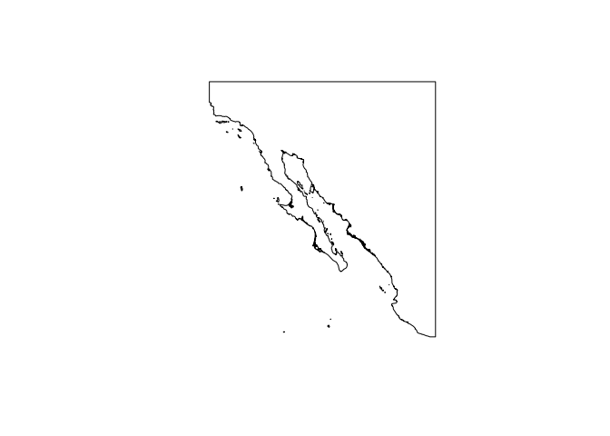

Podemos personalizar este mapa usando muchos de los argumentos
presentados antes, además de que existen otros propios de la clase.

``` r
plot(mapa, xlim = c(-120, -105), ylim = c(20, 35), las = 1, 
     col = "grey90", border = "grey", axes = TRUE)
box()
```


En el mapa anterior es posible agregar múltiples elementos, desde texto
(función `text()`), hasta transectos (función `lines()`), localidades de
colecta de muestras o lances de pesca (función `points()`), por
mencionar algúnos ejemplos.

#### Datos de sensores remotos

Un ejemplo más sería la representación de variables oceánicas obtenidas
por satélites, resultantes de modelos oceanográficos, o una combinación
de ambos.

El paquete **satin** tiene funciones para este propósito e incluye datos
de ejemplo que podemos utilizar para ilustrar este caso.

``` r
library(satin)
```


    Attaching package: 'satin'

    The following object is masked from 'package:sp':

        imageScale

``` r
data("dsst")
dsst
```

    Object of class satin

     Title: HMODISA Level-3 Standard Mapped Image 
     Long name: 4um Sea Surface Temperature 
     Name: sst4 
     Units: degree_C 
     Temporal range: 8-day 
     Spatial resolution: 4.64 km 

    Data dimensions:
     360 360 1 

    Data ranges:
              lon      lat   sst4     period
    min -118.9792 20.02083  9.670 2013-03-29
    max -104.0208 34.97917 27.435 2013-04-06

La figura por defecto, solo incluyendo el mapa anterior

``` r
plot(dsst, map = mapa)
```

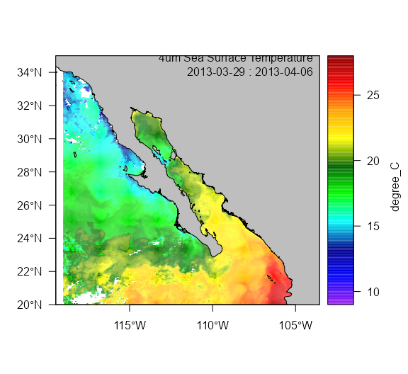

#### Ecogramas

Los ecogramas digitales producidos por ecosondas científicas también
podrían considerarse como provenientes de sensores remotos. El paquete
**echogram** permite procesar archivos HAC y RAW.

``` r
library(echogram)
hacfile <- system.file("extdata", "D20150510-T202500.hac", package = "echogram")
eco.038 <- read.echogram(hacfile)
echogram(eco.038)
```

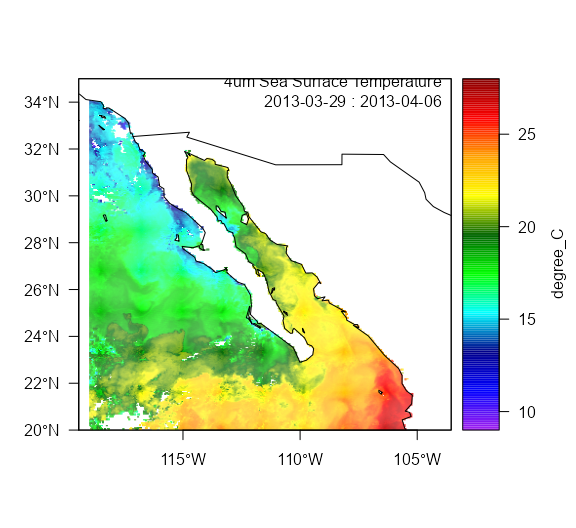

Con archivos RAW

``` r
ekraw <- read.EK60_raw("./Data/mango1402-D20140223-T172151.raw")
eco <- ek2echogram(ekraw)
str(eco)
```

    List of 3
     $ depth: num [1:5155] 0.097 0.194 0.291 0.388 0.485 ...
     $ Sv   : num [1:5155, 1:628] -12.29 5.14 9.56 12.18 6.1 ...
      ..- attr(*, "frequency")= chr "38 kHz"
      ..- attr(*, "variable")= chr "Sv"
     $ pings:'data.frame':  628 obs. of  4 variables:
      ..$ pingTime : POSIXct[1:628], format: "2014-02-23 17:21:51" "2014-02-23 17:21:52" ...
      ..$ detBottom: logi [1:628] NA NA NA NA NA NA ...
      ..$ speed    : logi [1:628] NA NA NA NA NA NA ...
      ..$ cumdist  : logi [1:628] NA NA NA NA NA NA ...
     - attr(*, "class")= chr "echogram"

Figura

``` r
echogram(eco)
```

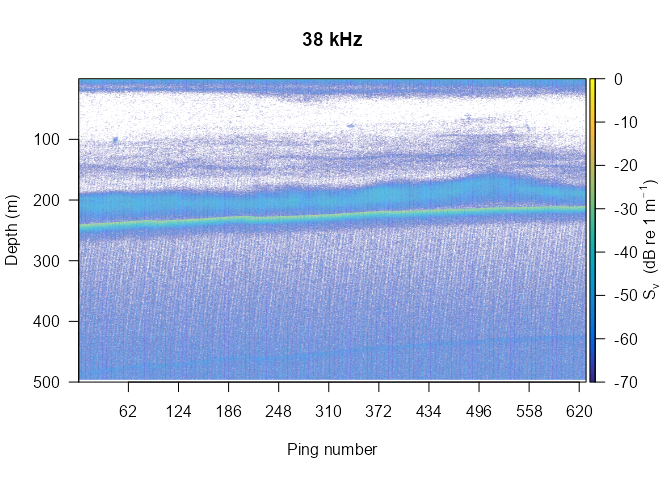

Personalización

``` r
bot <- read.EK_bot("./Data/mango1402-D20140223-T172151.bot")
head(bot)
```

                 pingTime depth.tr1 depth.tr2
    1 2014-02-23 17:21:51  239.8806  239.8484
    2 2014-02-23 17:21:52  239.8429  239.7479
    3 2014-02-23 17:21:53  239.8127  239.6670
    4 2014-02-23 17:21:54  239.6761  239.6238
    5 2014-02-23 17:21:55  239.6037  239.4917
    6 2014-02-23 17:21:56  239.4705  239.5138

``` r
plot(bot$depth.tr1, ylim = rev(c(0, 240)), type = "l")
```

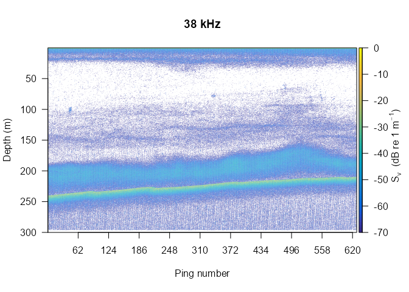

``` r
# hora local
library(lubridate)
```


    Attaching package: 'lubridate'

    The following objects are masked from 'package:base':

        date, intersect, setdiff, union

``` r
eco$pings$pingTime <- with_tz(eco$pings$pingTime, tzone = "America/Hermosillo")
# Guardar fondo detectado
eco$pings$detBottom <- bot$depth.tr1
eco2 <- mask.echogram(eco, bott.off = -20)
echogram(eco2, depth.max = 265, x.ref = "s", scheme = "EK500", seabed = TRUE)
```

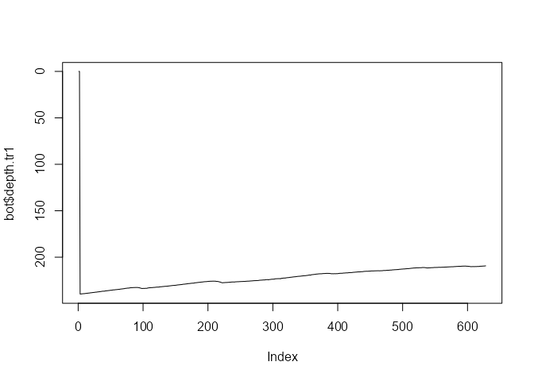

## Gráficas grid

El paquete grid proporciona funciones de bajo nivel para producir
líneas, polígonos, texto, símbolos, etc. Existen dos paquetes que hacen
uso de estas funciones de bajo nivel para generar resultados completos.

### Lattice

``` r
library(lattice)
xyplot(bill_length_mm ~ bill_depth_mm | species, data = penguins)
```

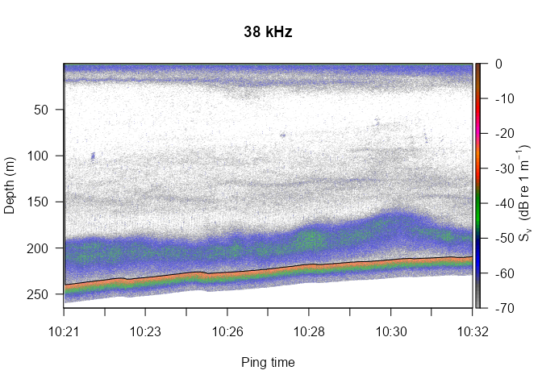

### ggplot2

``` r
library(ggplot2)
p <- ggplot(data = penguins, 
            aes(x = bill_length_mm, y = bill_depth_mm, colour = species)) +
     geom_point()
p
```

    Warning: Removed 2 rows containing missing values (`geom_point()`).

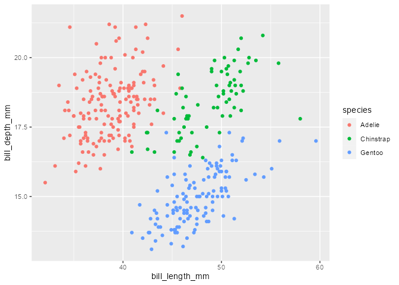
