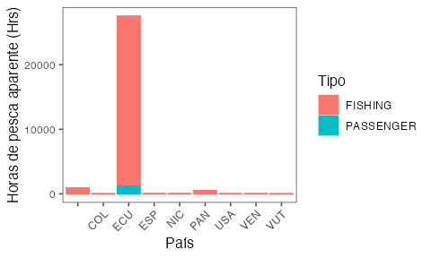
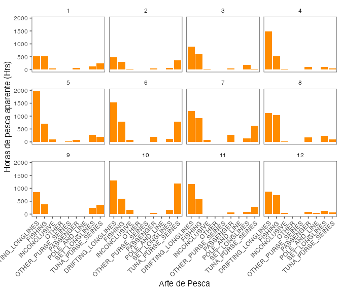
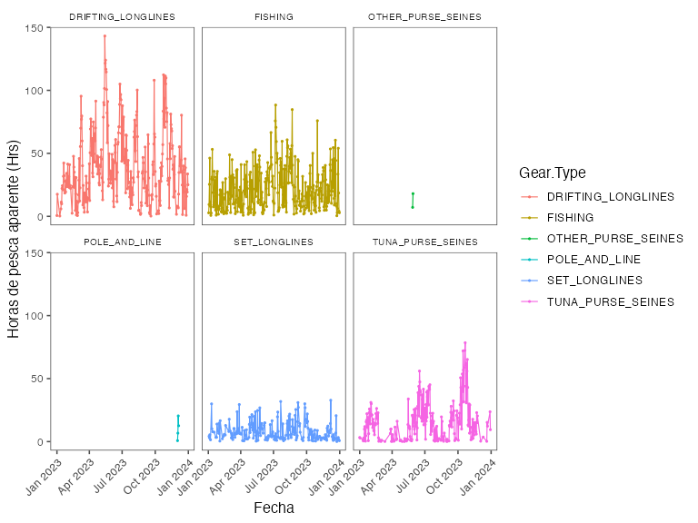
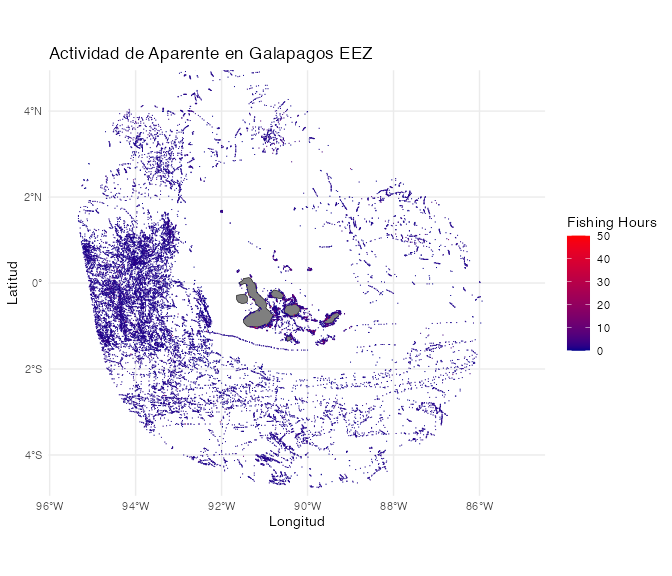

# Trabajando con datos de Global Fishing Watch
Jorge Cornejo-Donoso
November 18, 2024

-   [Global Fishing Watch](#global-fishing-watch)
-   [Datos](#datos)
    -   [Descripción de los datos](#descripción-de-los-datos)
-   [Propuesta de Análisis](#propuesta-de-análisis)
-   [Análisis Paso a paso](#análisis-paso-a-paso)
    -   [Actividad de pesca aparente por país de
        registro](#actividad-de-pesca-aparente-por-país-de-registro)
    -   [Actividad de pesca aparente por arte de
        pesca](#actividad-de-pesca-aparente-por-arte-de-pesca)
    -   [Serie temporal de actividad diaria de pesca
        aparente](#serie-temporal-de-actividad-diaria-de-pesca-aparente)
        -   [Para todos los países](#para-todos-los-países)
        -   [Para los países principales](#para-los-países-principales)
        -   [Para los tres artes de pesca
            principales](#para-los-tres-artes-de-pesca-principales)
    -   [Análisis espacial de la actividad de pesca
        aparente](#análisis-espacial-de-la-actividad-de-pesca-aparente)
        -   [Zonas con mayor actividad de pesca aparente total
            anual](#zonas-con-mayor-actividad-de-pesca-aparente-total-anual)
        -   [Zonas con mayor actividad de pesca aparente aculada por
            mes](#zonas-con-mayor-actividad-de-pesca-aparente-aculada-por-mes)
        -   [](#section)

# Global Fishing Watch


Global Fishing Watch (GFW) es una organización no gubernamental (ONG)
que busca avanzar en la gobernanza de los océanos a través de una mayor
transparencia de la actividad humana en el mar. Al crear y compartir
públicamente visualizaciones de mapas, datos y herramientas de análisis,
permiten la investigación científica e impulsan una transformación en la
forma en que gestiona el océano.

Global Fishing Watch genera nuevo conocimiento utilizando tecnología de
punta para convertir big data en información procesable. Comparten esa
información públicamente y de forma gratuita para acelerar la ciencia e
impulsar políticas y prácticas más justas e inteligentes que recompensen
el buen comportamiento y protejan la biodiversidad, la pesca y los
medios de subsistencia.

Para más información http://www.globalfishingwatch.org

Mapa de visualización y acceso a datos
<http://www.globalfishingwatch.org/map>

# Datos

GFW compila una cantidad masiva da datos de posiciones de embarcaciones
(AIS y VMS), de registro de embarcaciones y otra infraestructuras
marinas, y las hace disponibles en sus distintas plataformas. El acceso
a estos datos e información es completamente gratuita y se puede hacer
directamente en sus plataformas
[WEB](http://www.globalfishingwatch.org/map),
[API](https://globalfishingwatch.org/es/nuestras-api/), [paquete de
R](https://github.com/GlobalFishingWatch/gfwr) y de [libreria de
Python](https://pypi.org/project/gfw/).

Si bien la mayoría de los datos de GFW son gratuitos y de libre uso,
para acceder a alguno de ellos es necesario crear una cuenta, esto es
totalmente gratuito. Para esto se va a la página principal de la
plataforma (<http://www.globalfishingwatch.org/map>) y en el extremo
inferior izquierdo se puede hacer click en el icono
(), se debe
seguir el proceso de registro y se tiene acceso a descargar los datos.

Para este ejercicio, vamos a usar los datos de esfuerzo de pesca
aparente, derivado de los dispositivos AIS, para todo el año 2023, en la
[zona economica exclusiva que rodea las islas
Galápagos](https://globalfishingwatch.org/map/index?start=2024-08-12T00%3A00%3A00.000Z&end=2024-11-12T00%3A00%3A00.000Z&longitude=-87.53436510669711&latitude=-0.1438653714849388&zoom=5.3216383206620534&sbO=true&dvIn%5B0%5D%5Bid%5D=presence&dvIn%5B0%5D%5Bcfg%5D%5Bvis%5D=false&dvIn%5B1%5D%5Bid%5D=context-layer-eez&dvIn%5B1%5D%5Bcfg%5D%5Bvis%5D=true&dvIn%5B2%5D%5Bid%5D=vms&dvIn%5B2%5D%5Bcfg%5D%5Bvis%5D=false&dvIn%5B3%5D%5Bid%5D=ais&dvIn%5B3%5D%5Bcfg%5D%5Bvis%5D=true&tV=heatmap)
de la república del Ecuador, tanto como una serie de tiemporal diaria
por barco y por unidad espacial (0.01°x0.01°) .

Durante la presentación se describirá como acceder a estos datos, sin
embarco en este documento solo se comparte el resultado de este proceso
([descarga de
datos](https://drive.google.com/file/d/1cyZmiR8MJyGAETPqnnN9mRBOjm8VqSXA/view?usp=sharing)).

## Descripción de los datos

Los datos temporales que vamos a utilizar en este ejercicio son las
horas de pesca aparente diaria por embarcación detectada dentro de esta
área de interés.

Estos datos además contienen información acerca de las embarcaciones,
con nombre, numero IMO, bandera, arte de pesca entre otros
(<a href="#tbl-datosTS" class="quarto-xref">Table 1</a>).

``` r
data <- read.csv("datos/Temporal_Ecuadorian Exclusive Economic Zone (Galapagos) - 2023-01-01T00_00_00.000Z,2024-01-01T00_00_00.000Z/layer-activity-data-0/public-global-fishing-effort-v3.0.csv")

knitr::kable(head(data))
```

<table class="do-not-create-environment cell">
<colgroup>
<col style="width: 5%" />
<col style="width: 2%" />
<col style="width: 6%" />
<col style="width: 10%" />
<col style="width: 10%" />
<col style="width: 9%" />
<col style="width: 6%" />
<col style="width: 5%" />
<col style="width: 2%" />
<col style="width: 4%" />
<col style="width: 12%" />
<col style="width: 11%" />
<col style="width: 11%" />
</colgroup>
<thead>
<tr class="header">
<th style="text-align: left;">Time.Range</th>
<th style="text-align: left;">Flag</th>
<th style="text-align: left;">Vessel.Name</th>
<th style="text-align: left;">Entry.Timestamp</th>
<th style="text-align: left;">Exit.Timestamp</th>
<th style="text-align: left;">Gear.Type</th>
<th style="text-align: left;">Vessel.Type</th>
<th style="text-align: right;">MMSI</th>
<th style="text-align: right;">IMO</th>
<th style="text-align: left;">CallSign</th>
<th style="text-align: left;">First.Transmission.Date</th>
<th style="text-align: left;">Last.Transmission.Date</th>
<th style="text-align: right;">Apparent.Fishing.Hours</th>
</tr>
</thead>
<tbody>
<tr class="odd">
<td style="text-align: left;">2023-01-10</td>
<td style="text-align: left;">ECU</td>
<td style="text-align: left;">DONA ROGE</td>
<td style="text-align: left;">2023-01-10T10:00:00Z</td>
<td style="text-align: left;">2023-10-07T11:00:00Z</td>
<td style="text-align: left;">TUNA_PURSE_SEINES</td>
<td style="text-align: left;">FISHING</td>
<td style="text-align: right;">735057685</td>
<td style="text-align: right;">NA</td>
<td style="text-align: left;">HC4301</td>
<td style="text-align: left;">2020-09-07T16:27:31Z</td>
<td style="text-align: left;">2024-10-21T03:13:40Z</td>
<td style="text-align: right;">1.49</td>
</tr>
<tr class="even">
<td style="text-align: left;">2023-04-15</td>
<td style="text-align: left;">ECU</td>
<td style="text-align: left;">TINTORERA</td>
<td style="text-align: left;">2023-01-03T13:00:00Z</td>
<td style="text-align: left;">2023-04-15T17:00:00Z</td>
<td style="text-align: left;">FISHING</td>
<td style="text-align: left;">FISHING</td>
<td style="text-align: right;">735059515</td>
<td style="text-align: right;">NA</td>
<td style="text-align: left;">HC-5964</td>
<td style="text-align: left;">2020-05-31T16:10:36Z</td>
<td style="text-align: left;">2024-03-08T18:17:43Z</td>
<td style="text-align: right;">0.50</td>
</tr>
<tr class="odd">
<td style="text-align: left;">2023-06-13</td>
<td style="text-align: left;">ECU</td>
<td style="text-align: left;">DONA ROGE</td>
<td style="text-align: left;">2023-01-10T10:00:00Z</td>
<td style="text-align: left;">2023-10-07T11:00:00Z</td>
<td style="text-align: left;">TUNA_PURSE_SEINES</td>
<td style="text-align: left;">FISHING</td>
<td style="text-align: right;">735057685</td>
<td style="text-align: right;">NA</td>
<td style="text-align: left;">HC4301</td>
<td style="text-align: left;">2020-09-07T16:27:31Z</td>
<td style="text-align: left;">2024-10-21T03:13:40Z</td>
<td style="text-align: right;">1.15</td>
</tr>
<tr class="even">
<td style="text-align: left;">2023-07-13</td>
<td style="text-align: left;">ECU</td>
<td style="text-align: left;">GRAND KNIGHT</td>
<td style="text-align: left;">2023-05-25T23:00:00Z</td>
<td style="text-align: left;">2023-07-13T11:00:00Z</td>
<td style="text-align: left;">DRIFTING_LONGLINES</td>
<td style="text-align: left;">FISHING</td>
<td style="text-align: right;">735058937</td>
<td style="text-align: right;">NA</td>
<td style="text-align: left;">HC5259</td>
<td style="text-align: left;">2022-07-29T23:58:42Z</td>
<td style="text-align: left;">2023-08-06T02:33:27Z</td>
<td style="text-align: right;">11.26</td>
</tr>
<tr class="odd">
<td style="text-align: left;">2023-08-06</td>
<td style="text-align: left;">ECU</td>
<td style="text-align: left;">JOTA JOTA</td>
<td style="text-align: left;">2023-04-07T06:00:00Z</td>
<td style="text-align: left;">2023-10-01T19:00:00Z</td>
<td style="text-align: left;">DRIFTING_LONGLINES</td>
<td style="text-align: left;">FISHING</td>
<td style="text-align: right;">735058780</td>
<td style="text-align: right;">NA</td>
<td style="text-align: left;">HC2508</td>
<td style="text-align: left;">2022-01-03T17:28:38Z</td>
<td style="text-align: left;">2024-11-12T23:56:26Z</td>
<td style="text-align: right;">8.31</td>
</tr>
<tr class="even">
<td style="text-align: left;">2023-09-12</td>
<td style="text-align: left;">ECU</td>
<td style="text-align: left;">DON F</td>
<td style="text-align: left;">2023-06-19T22:00:00Z</td>
<td style="text-align: left;">2023-10-05T13:00:00Z</td>
<td style="text-align: left;">TUNA_PURSE_SEINES</td>
<td style="text-align: left;">FISHING</td>
<td style="text-align: right;">735060354</td>
<td style="text-align: right;">NA</td>
<td style="text-align: left;">HC6655</td>
<td style="text-align: left;">2023-05-08T22:41:27Z</td>
<td style="text-align: left;">2024-11-12T23:58:56Z</td>
<td style="text-align: right;">11.88</td>
</tr>
</tbody>
</table>

En relación a los datos espaciales que se van a utilizar en este
ejercicio son las horas de pesca aparente diaria por unidad espacial de
0.01°x0.01° de latitud y longitud
(<a href="#tbl-datosSP" class="quarto-xref">Table 2</a>).

``` r
dataSP <- read.csv("datos/Espacial_Ecuadorian Exclusive Economic Zone (Galapagos) - 2023-01-01T00_00_00.000Z,2024-01-01T00_00_00.000Z/layer-activity-data-0/public-global-fishing-effort-v3.0.csv")

knitr::kable(head(dataSP))
```

<table class="do-not-create-environment cell">
<thead>
<tr class="header">
<th style="text-align: right;">Lat</th>
<th style="text-align: right;">Lon</th>
<th style="text-align: left;">Time.Range</th>
<th style="text-align: left;">flag</th>
<th style="text-align: right;">Vessel.IDs</th>
<th style="text-align: right;">Apparent.Fishing.Hours</th>
</tr>
</thead>
<tbody>
<tr class="odd">
<td style="text-align: right;">4.45</td>
<td style="text-align: right;">-91.19</td>
<td style="text-align: left;">2023-02-23</td>
<td style="text-align: left;">ECU</td>
<td style="text-align: right;">1</td>
<td style="text-align: right;">0.02</td>
</tr>
<tr class="even">
<td style="text-align: right;">3.39</td>
<td style="text-align: right;">-94.24</td>
<td style="text-align: left;">2023-02-20</td>
<td style="text-align: left;">ECU</td>
<td style="text-align: right;">1</td>
<td style="text-align: right;">1.12</td>
</tr>
<tr class="odd">
<td style="text-align: right;">3.45</td>
<td style="text-align: right;">-90.77</td>
<td style="text-align: left;">2023-02-23</td>
<td style="text-align: left;">ECU</td>
<td style="text-align: right;">1</td>
<td style="text-align: right;">0.42</td>
</tr>
<tr class="even">
<td style="text-align: right;">2.77</td>
<td style="text-align: right;">-94.29</td>
<td style="text-align: left;">2023-02-18</td>
<td style="text-align: left;">ECU</td>
<td style="text-align: right;">1</td>
<td style="text-align: right;">2.53</td>
</tr>
<tr class="odd">
<td style="text-align: right;">3.66</td>
<td style="text-align: right;">-93.88</td>
<td style="text-align: left;">2023-02-03</td>
<td style="text-align: left;">ECU</td>
<td style="text-align: right;">1</td>
<td style="text-align: right;">0.88</td>
</tr>
<tr class="even">
<td style="text-align: right;">3.22</td>
<td style="text-align: right;">-93.74</td>
<td style="text-align: left;">2023-02-17</td>
<td style="text-align: left;">ECU</td>
<td style="text-align: right;">1</td>
<td style="text-align: right;">0.67</td>
</tr>
</tbody>
</table>

# Propuesta de Análisis

Los objetivos de este análisis serán:

1.  Identificar los países con mayor actividad de pesca en la ZEE de las
    islas galápagos.

2.  Conocer los artes de pesca que realizan el mayor esfuerzo de pesca
    dentro de la ZEE de las islas Galápagos.

3.  Obtener una serie temporal diaria de la actividad de pesca.

    1.  Todos los países combinados.

    2.  Para los países principales.

    3.  Para los artes de pesca.

4.  Identificar las zonas con mayor actividad de pesca.

5.  Identificar los periodos (meses) con mayor actividad de pesca.

# Análisis Paso a paso

## Actividad de pesca aparente por país de registro

Para analizar los datos de pesca aparente por país de registro, tenemos
que agrupar los datos por país y sumar las horas de pesca aparente para
cada uno de ellos.

Esto lo vamos a hacer en dos pasos:

1.  Actividad acumulada de pesca aparente para todo el año por país,
    esto lo presentaremos en un gráfico.  
    Para esto primero agrupamos todas las embarcaciones que pertenecen
    al mismo país (`Flag`) y que son del mismo tipo (`Vessel.Type`),
    para luego sumar las horas de pesca aparente
    (`Apparent.Fishing.Hours`).

``` r
hpAnual <- data %>%
  group_by(Flag, Vessel.Type) %>% 
  summarise(hp = sum(Apparent.Fishing.Hours, na.rm=T))
```

Ahora que tenemos el número acumulado de horas podemos crear un gráfico
usando **ggplot**.

``` r
ggplot(hpAnual) +
  geom_col(aes(x=Flag, y=hp, colour = Vessel.Type, fill=Vessel.Type)) +
  xlab("País") +
  ylab("Horas de pesca aparente (Hrs)") +
  scale_fill_discrete(name = "Tipo") +
  scale_colour_discrete(name = "Tipo") +
  ggthemes::theme_few() +
  theme(axis.text.x = element_text(angle = 45, hjust = 1)) 
```



1.  Actividad mensual de pesca aparente por de pesca por país y lo
    presentaremos en un gráfico.

    El proceso en este caso es similar, pero se debe ahora agrupar
    también por el `mes`. Para esto es necesario crear la columna
    **mes**, esto lo hacemos usando la funcion `dplr::mutate` y
    `lubridate::month`.

``` r
hpMes <- data %>%
  mutate(mes = month(Time.Range)) %>%  ## <- Obtenemos el mes desde la columna de la fecha
  group_by(mes, Flag, Vessel.Type) %>% ## Incluimos el mes en el grouping
  summarise(hp = sum(Apparent.Fishing.Hours, na.rm=T))

ggplot(hpMes) +
  geom_col(aes(x=Flag, y=hp, colour = Vessel.Type, fill=Vessel.Type)) +
  xlab("País") +
  ylab("Horas de pesca aparente (Hrs)") +
  scale_fill_discrete(name = "Tipo") +
  scale_colour_discrete(name = "Tipo") +
  ggthemes::theme_few() +
  theme(axis.text.x = element_text(angle = 45, hjust = 1)) +
  facet_wrap(~mes) ## <- Esto permite crear el grafico separando los meses
```



## Actividad de pesca aparente por arte de pesca

Ahora podemos hacer exactamente el mismo proceso, pero esta vez en vez
de usar el pais como variable de agrupación usamos el arte de pesca.

En esta ocasión, generamos dos data.frames en el mismo chunk de R, el
anual y el mensual.

``` r
arteAnual <- data %>%
  group_by(Gear.Type, Vessel.Type) %>% 
  summarise(hp = sum(Apparent.Fishing.Hours, na.rm=T))
  

arteMensual <- data %>%
  mutate(mes = month(Time.Range)) %>%
  group_by(mes, Gear.Type, Vessel.Type) %>% 
  summarise(hp = sum(Apparent.Fishing.Hours, na.rm=T))
```

Y ahora presentamos los gráficos por arte de pesca.

``` r
ggplot(arteAnual) +
  geom_col(aes(x=Gear.Type, y=hp), fill ="darkorange") +
  xlab("Arte de Pesca") +
  ylab("Horas de pesca aparente (Hrs)") +
  scale_fill_discrete(name = "Tipo") +
  scale_colour_discrete(name = "Tipo") +
  ggthemes::theme_few() +
  theme(axis.text.x = element_text(angle = 45, hjust = 1)) 
```


Ahora presente el mismo tipo de gráficos, pero usamos `facet_wrap` para
separar los artes de pesca, de esto forma motramos las horas de pesca
aparente para cada mes, separando por el arte de pesca.

``` r
ggplot(arteMensual) +
  geom_col(aes(x=Gear.Type, y=hp), fill="darkorange") +
  xlab("Arte de Pesca") +
  ylab("Horas de pesca aparente (Hrs)") +
  scale_fill_discrete(name = "Tipo") +
  scale_colour_discrete(name = "Tipo") +
  ggthemes::theme_few() +
  theme(axis.text.x = element_text(angle = 45, hjust = 1)) +
  facet_wrap(~mes) ## <- Esto permite crear el grafico separando los meses
```


## Serie temporal de actividad diaria de pesca aparente

### Para todos los países

Ahora vamos a ver como es el esfuerzo de pesca aparente diario, para
esto copararemos la actitividad total y luego por paises.

En este caso, lo que tenemos que hacer es agrupar el esfuerzo de pesca
aparente por día (sumando el esfuerzo individual de cada barco), esto
luego lo podemos hacer separando por país y/o arte de pesca.

En los gráficos anteriores vimos que Ecuador es el pías que realiza el
mayor esfuerzo en esta área. Es por esto que solo usaremos los barcos
ecuatorianos para este ejemplo. De esta forma es necesario filtrar los
datos y para esto usamos la función `dplyr::filter` .

``` r
hpDiaEcu <- data %>%
  filter(Flag == "ECU") %>%  ## Aqui es donde filtramos para barcos de ecuador
  group_by(Time.Range) %>% ## Incluimos el mes en el grouping
  summarise(hp = sum(Apparent.Fishing.Hours, na.rm=T))
```

Y ahora vemos la serie temporal.

``` r
ggplot(hpDiaEcu) +
  geom_line(aes(x=as.Date(Time.Range), y=hp), col="darkorange") +
  xlab("Fecha") +
  ylab("Horas de pesca aparente (Hrs)") +
  ggthemes::theme_few() +
  theme(axis.text.x = element_text(angle = 45, hjust = 1))
```



### Para los países principales

Ahora haremos este gráfico temporal para los tres países (excluido
Ecuador) que realizan el mayor esfuerzo de pesca aparente en la ZEE de
las islas Galápagos.

Para esto entonces necesitamos excluir los barcos con bandera de ecuador
(`filter != "ECU"`) y aquellas sin bandera conocida (`!is.na(Flag)`).

Con esto ahora, calculamos el total de horas de esfuerzo de pesca
aparente por pías.

``` r
porPais <- data %>%
  filter(Flag != "ECU", Flag != "",
         !is.na(Flag)) %>%  ## Eliminamos embarcaciones de Ecuador y aquellas sin bandera
  group_by(Flag) %>% ## Incluimos el mes en el grouping
  summarise(hp = sum(Apparent.Fishing.Hours, na.rm=T)) %>% 
  arrange(desc(hp))

knitr::kable(porPais)
```

<table class="do-not-create-environment cell">
<thead>
<tr class="header">
<th style="text-align: left;">Flag</th>
<th style="text-align: right;">hp</th>
</tr>
</thead>
<tbody>
<tr class="odd">
<td style="text-align: left;">PAN</td>
<td style="text-align: right;">521.05</td>
</tr>
<tr class="even">
<td style="text-align: left;">NIC</td>
<td style="text-align: right;">20.35</td>
</tr>
<tr class="odd">
<td style="text-align: left;">ESP</td>
<td style="text-align: right;">19.43</td>
</tr>
<tr class="even">
<td style="text-align: left;">VEN</td>
<td style="text-align: right;">14.66</td>
</tr>
<tr class="odd">
<td style="text-align: left;">USA</td>
<td style="text-align: right;">6.11</td>
</tr>
<tr class="even">
<td style="text-align: left;">VUT</td>
<td style="text-align: right;">0.34</td>
</tr>
<tr class="odd">
<td style="text-align: left;">COL</td>
<td style="text-align: right;">0.21</td>
</tr>
</tbody>
</table>

En la tabla <a href="#tbl-hpXPais" class="quarto-xref">Table 3</a> que
vamos que las horas de pesca de Vunuatu (VUT) y Colombia (COL) son
insignificantes y pueden corresponder a falsos positivos, es por esto
que tambien los eliminaremos del análisis.

``` r
diaNoEcu <- data %>%
  filter(Flag == c("PAN", "NIC" ,"ESP", "VEN", "USA")) %>%
  group_by(Flag, Time.Range) %>% ## Incluimos el mes en el grouping
  summarise(hp = sum(Apparent.Fishing.Hours, na.rm=T))
```

``` r
ggplot(diaNoEcu) +
  geom_point(aes(x=as.Date(Time.Range), y=hp, col = Flag)) +
  geom_line(aes(x=as.Date(Time.Range), y=hp, col = Flag)) +
  xlab("Fecha") +
  ylab("Horas de pesca aparente (Hrs)") +
  ggthemes::theme_few() +
  theme(axis.text.x = element_text(angle = 45, hjust = 1)) +
  facet_wrap(~Flag)
```



### Para los tres artes de pesca principales

Ahora hacemos lo mismo para los artes de pesca.

``` r
arteDia <- data %>% 
  filter(Gear.Type != "INCONCLUSIVE",
         Gear.Type != "OTHER",
         Gear.Type != "PASSENGER"
         ) %>% 
  group_by(Gear.Type, Time.Range) %>% ## Incluimos el mes en el grouping
  summarise(hp = sum(Apparent.Fishing.Hours, na.rm=T))


data %>% 
  filter(Gear.Type != "INCONCLUSIVE",
         Gear.Type != "OTHER",
         Gear.Type != "PASSENGER"
         ) %>% 
  group_by(Gear.Type) %>% ## Incluimos el mes en el grouping
  summarise(hp = sum(Apparent.Fishing.Hours, na.rm=T)) %>% 
  arrange(desc(hp)) %>% 
  knitr::kable()
```

<table class="do-not-create-environment cell">
<thead>
<tr class="header">
<th style="text-align: left;">Gear.Type</th>
<th style="text-align: right;">hp</th>
</tr>
</thead>
<tbody>
<tr class="odd">
<td style="text-align: left;">DRIFTING_LONGLINES</td>
<td style="text-align: right;">13356.48</td>
</tr>
<tr class="even">
<td style="text-align: left;">FISHING</td>
<td style="text-align: right;">7703.03</td>
</tr>
<tr class="odd">
<td style="text-align: left;">TUNA_PURSE_SEINES</td>
<td style="text-align: right;">4262.67</td>
</tr>
<tr class="even">
<td style="text-align: left;">SET_LONGLINES</td>
<td style="text-align: right;">1863.25</td>
</tr>
<tr class="odd">
<td style="text-align: left;">POLE_AND_LINE</td>
<td style="text-align: right;">40.45</td>
</tr>
<tr class="even">
<td style="text-align: left;">OTHER_PURSE_SEINES</td>
<td style="text-align: right;">25.17</td>
</tr>
</tbody>
</table>

Ahora podemos presentar estos resultados.

``` r
ggplot(arteDia) +
  geom_point(aes(x=as.Date(Time.Range), y=hp, col = Gear.Type), size=.4) +
  geom_line(aes(x=as.Date(Time.Range), y=hp, col = Gear.Type), size=.4) +
  xlab("Fecha") +
  ylab("Horas de pesca aparente (Hrs)") +
  ggthemes::theme_few() +
  theme(axis.text.x = element_text(angle = 45, hjust = 1),
    strip.text = element_text(size = 8)  # Adjust the facet title size
    )+
  facet_wrap(~Gear.Type)
```


## Análisis espacial de la actividad de pesca aparente

Ahora trabajamos con los datos espacialesomamos los datos espaciales

### Zonas con mayor actividad de pesca aparente total anual

Aqui agrupamos los datos espaciales, sumando las horas de pesca aparente
para todo el año, en cada una de las celdas y luego lo presentamos.

``` r
spAnual <- dataSP %>% 
  group_by(Lat, Lon) %>% 
  summarise(hp = sum(Apparent.Fishing.Hours, na.rm=T))
```

Ahora hacemos el mapa

``` r
ggplot(spAnual) +
  geom_tile(aes(x=Lon, y=Lat, z=hp))
```


Esta imágen se ve bastante mal, es necestio agregarlos las islas y mejor
la presentación en términos generales.

``` r
# Get Galapagos land data

spAnual_sf <- st_as_sf(spAnual, coords = c("Lon", "Lat"), crs = 4326) # Lo transforma a un                                                              objeto geográfico

galapagos_land <- ne_countries(scale = "medium", returnclass = "sf") %>%
  filter(name == "Ecuador")  # Filter for Ecuador, as Galapagos belongs to Ecuador

ggplot() +
  # Add base map
  geom_sf(data = galapagos_land, fill = "grey50", color = "black") +
  # Add fishing data
  geom_tile(data = spAnual, aes(x = Lon, y = Lat, fill = hp, col=hp)) +
  # Define color gradient
  scale_color_gradient(low = "darkblue", high = "red", name = "Fishing Hours", limits = c(0, 50)) +
  scale_fill_gradient(low = "darkblue", high = "red", name = "Fishing Hours", limits = c(0, 50)) +
  scale_size_continuous(name = "Horas de Pesca Aparente") +
  labs(
    title = "Actividad de Aparente en Galapagos EEZ",
    x = "Longitud",
    y = "Latitud"
  ) +
  theme_minimal() +
  coord_sf(xlim = c(-95.5, -85), ylim = c(-4.5, 4.5))  # Adjust limits to Galapagos region
```


### Zonas con mayor actividad de pesca aparente aculada por mes

Ahora haremos el mismo gráfico, pero separados por mes.

``` r
spMensual <- dataSP %>% 
  mutate(mes = month(Time.Range)) %>% 
  group_by(mes, Lat, Lon) %>% 
  summarise(hp = sum(Apparent.Fishing.Hours, na.rm=T))

ggplot() +
  geom_sf(data = galapagos_land, fill = "grey50", color = "black") +
  geom_tile(data = spMensual, aes(x = Lon, y = Lat, fill = hp, col=hp)) +
  scale_color_gradient(low = "darkblue", high = "red", name = "Fishing Hours", limits = c(0, 50)) +
  scale_fill_gradient(low = "darkblue", high = "red", name = "Fishing Hours", limits = c(0, 50)) +
  scale_size_continuous(name = "Horas de Pesca Aparente") +
  labs(
    title = "Actividad de Aparente en Galapagos EEZ",
    x = "Longitud", y = "Latitud" ) +
  theme_minimal() +
  coord_sf(xlim = c(-95.5, -85), ylim = c(-4.5, 4.5))  +# Adjust limits to Galapagos region
  facet_wrap(~mes)
```


