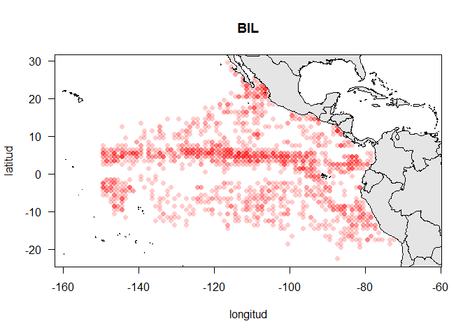
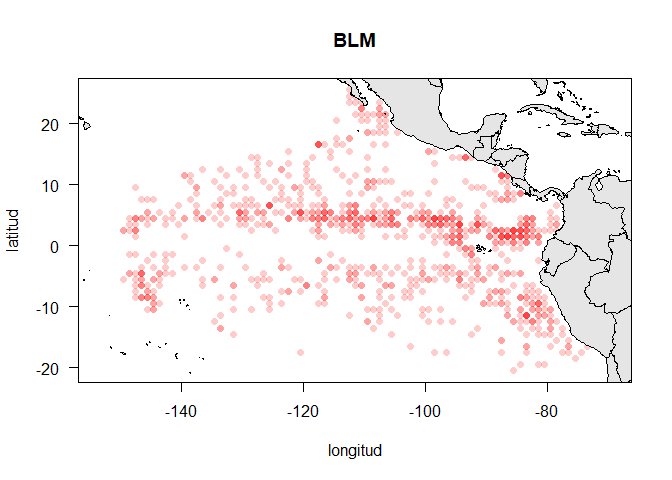
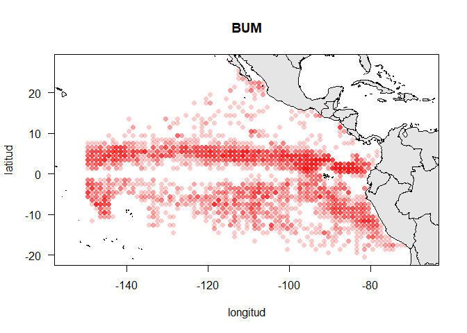
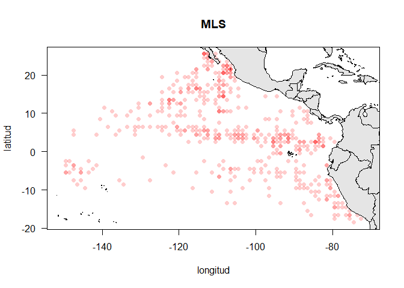
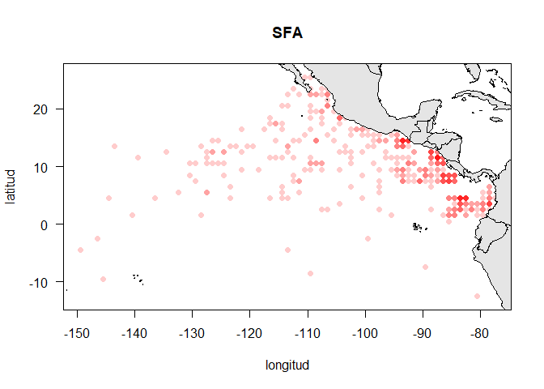
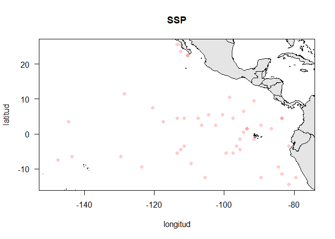
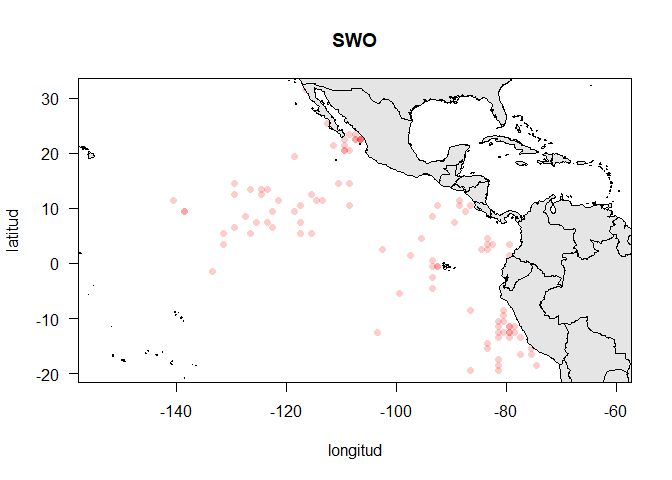

Captura incidental de peces de pico en la pesquería de atún tropical
================
Héctor Villalobos

## Introducción

En este tutorial mostraremos el uso de datos de libre acceso sobre
captura incidental de peces de pico en la pesquería con red de cerco
recopilados por observadores a bordo de buques atuneros que operan en el
Océano Pacífico Oriental.

Estos datos son administrados por la Comisión Interamericana del Atún
Tropical (CIAT) y se encuentran disponibles para su descarga en:
<https://www.iattc.org/es-ES/Data/Public-domain>.

La información se descarga en formato comprimido (zip) e incluye un pdf
(`PSBillfish-Picudos.pdf`) con los detalles de los datos descargados y
los datos de captura incidental por país (`PublicPSBillfishFlag.csv`) y
por tipo de indicador de pesca (`PublicPSBillfishSetType.csv`). En este
tutorial nos enfocamos en el que contiene la información por tipo de
lance.

## Cargar paquetes

Para este tutorial requerimos tres paquetes:

``` r
library(sp)         # Clases y métodos para datos espaciales
library(lubridate)  # Manipulación fácil de fechas 
```


    Attaching package: 'lubridate'

    The following objects are masked from 'package:base':

        date, intersect, setdiff, union

``` r
library(PBSmapping) # Mapeo de datos pesqueros y herramientas de análisis espaciales
```


    -----------------------------------------------------------
    PBS Mapping 2.74.1 -- Copyright (C) 2003-2025 Fisheries and Oceans Canada

    PBS Mapping comes with ABSOLUTELY NO WARRANTY;
    for details see the file COPYING.
    This is free software, and you are welcome to redistribute
    it under certain conditions, as outlined in the above file.

    A complete user guide 'PBSmapping-UG.pdf' is located at 
    C:/Users/Hector/AppData/Local/R/win-library/4.5/PBSmapping/doc/PBSmapping-UG.pdf

    Packaged on 2024-09-25
    Pacific Biological Station, Nanaimo

    All available PBS packages can be found at
    https://github.com/pbs-software

    To see demos, type '.PBSfigs()'.
    Note: function 'importShapefile()' is temporarily unavailable.
    -----------------------------------------------------------

## Importar datos

Los datos descargados y ya descomprimidos se encuentran en la carpeta
`data` de este tutorial. Usamos la función `read.csv()` que solo
requiere especificar la ruta y nombre del archivo.

``` r
pic <- read.csv("./datos/PublicPSBillfishSetType.csv")
```

Podemos explorar los datos con la función `head()` que muestra los
primeros registros de estos. El contenido de cada cada columna puede
consultarse en el archivo `PSBillfish-Picudos.pdf` mencionado antes.

``` r
head(pic)
```

      Year Month SetType LatC1 LonC1 NumSets BIL BLM BUM MLS SFA SSP SWO
    1 1993     1     DEL -14.5 -85.5       1   0   0   0   0   0   0   0
    2 1993     1     DEL -13.5 -83.5       1   0   0   0   0   0   0   0
    3 1993     1     DEL -12.5 -83.5       1   0   0   0   0   0   0   0
    4 1993     1     DEL -11.5 -85.5       2   0   0   0   0   0   0   0
    5 1993     1     DEL -11.5 -84.5       3   0   0   0   0   0   0   0
    6 1993     1     DEL -11.5 -83.5       6   0   0   0   0   0   0   0

## Simplificar los datos

Dado que tenemos 32 años de datos a escala mensual para tres indicadores
de pesca, vamos a agregar los tipos de indicador por trimestre. Además,
nos concentraremos en los cuatro años más recientes.

``` r
# Primero conservamos solamente los años 2021-2024
pic <- pic[pic$Year > 2020, ]

# agregamos los tipos de indicador
pic <- aggregate(pic[, 6:13], by = list(year = pic$Year, month = pic$Month, 
                                        lat = pic$LatC1, lon = pic$LonC1), sum)

pic$fecha <- strptime(paste(pic$year, pic$month, 1, sep ="-"), format = "%Y-%m-%d")
pic$qtr <- quarter(pic$fecha)

# agregar por trimestre
pic <- aggregate(pic[, 5:12], by = list(year = pic$year, qtr = pic$qtr, 
                                        lat = pic$lat, lon = pic$lon), sum)
```

Con esto pasamos de 214,760 registros en la base original a sólo 18,009
después de simplificar.

``` r
head(pic)
```

      year qtr   lat    lon NumSets BIL BLM BUM MLS SFA SSP SWO
    1 2021   1 -10.5 -149.5       1   0   0   0   0   0   0   0
    2 2021   2 -10.5 -149.5       1   0   0   0   0   0   0   0
    3 2023   4  -8.5 -149.5       1   0   0   0   0   0   0   0
    4 2021   4  -7.5 -149.5       1   0   0   0   0   0   0   0
    5 2021   1  -6.5 -149.5       1   0   0   0   0   0   0   0
    6 2024   1  -6.5 -149.5       3   0   0   0   0   0   0   0

## Mapas de las capturas incidentales

Ahora podemos graficar la información simplificada por especie, primero
sin considerar el año o trimestre.

``` r
library(maps)  # Dibujar mapas

spp <- names(pic)[6:12]

for(sp in spp){
  plot(pic$lon[pic[, sp] > 0], pic$lat[pic[, sp] > 0], 
       asp = 1, main = sp, pch = 16, col = rgb(1, 0, 0, 0.2),
       xlab = "longitud", ylab = "latitud", las = 1)
  map("world", fill = TRUE, col = "grey90", main = "", 
      lwd = 0.5, add = TRUE)
  box()
}
```















Podemos obtener figuras más elaboradas con ayuda del paquete
`PBSmapping`. Antes cargaremos un mapa del noroeste de México incluido
en el paquete `satin`.

``` r
library(satin)
```


    Attaching package: 'satin'

    The following object is masked from 'package:sp':

        imageScale

``` r
 data(dmap)
detach(package:satin)
```

``` r
# Queremos acomodar 16 mapas en una misma figura, los años en 
cyq <- expand.grid(1:4, 2021:2024)
names(cyq) <- c("qtr", "year")

xaxs2 <- c("n", "n", "n", "n",
           "n", "n", "n", "n",
           "n", "n", "n", "n",
           "s", "n", "s", "n")

yaxs2 <- c("n", "n", "n", "n",
           "s", "n", "n", "n",
           "n", "n", "n", "n",
           "s", "n", "n", "n")

# Ejemplo: Capturas incidentales de Marlin rayado (MLS) 
# por trimestre para 2021-2024 
layout(matrix(1:16, ncol = 4, byrow = TRUE))
par(oma = c(4.5, 4.5, 1, 3), mar = c(0, 0, 0, 0))

for(i in 1:16){
  plot(dmap, axes = TRUE, ylim = c(22, 28), xlim = c(-115, -109), 
       col = "grey90", main = "", las = 1, lwd = 0.5, border = "grey",
       xaxt = xaxs2[i], yaxt = yaxs2[i])
  box(); text(-108, 27, paste(cyq$year[i], "_Q", cyq$qtr[i], sep =""))
  
  dat <- pic[pic$year == cyq$year[i] & pic$qtr == cyq$qtr[i], c('lon', 'lat', 'MLS')]
  names(dat) <- c("X", "Y", "Z")
  n <- nrow(dat)
  if(n > 0){
    dat <- data.frame(EID = 1:n, dat)
    class(dat) <- c("EventData", "data.frame")
    addBubbles(dat, legend.pos = NULL, z.max = 63, max.size = 0.6, 
               symbol.bg = rgb(1, 0, 0, 0.3))
  }
}
```


