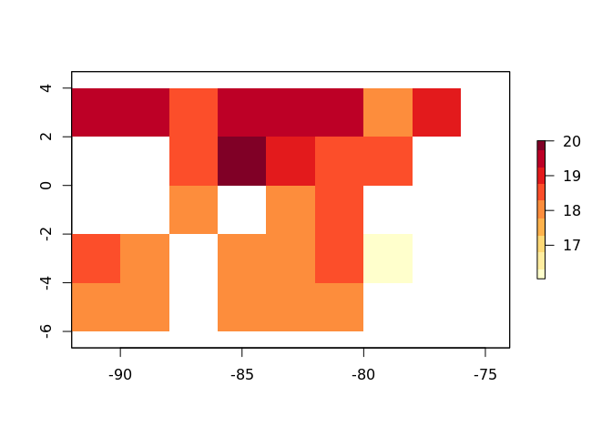
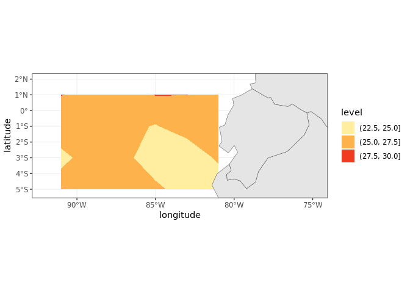

Datos espaciales en R
================
Denisse Fierro Arcos
2023-02-17

- <a href="#analisis-de-datos-espaciales-en-r"
  id="toc-analisis-de-datos-espaciales-en-r">Analisis de datos espaciales
  en <code>R</code></a>
  - <a href="#llamando-paquetes-relevantes"
    id="toc-llamando-paquetes-relevantes">Llamando paquetes relevantes</a>
  - <a href="#buscando-y-bajando-datos-de-la-noaa"
    id="toc-buscando-y-bajando-datos-de-la-noaa">Buscando y bajando datos de
    la NOAA</a>
  - <a href="#graficando-datos" id="toc-graficando-datos">Graficando
    datos</a>

# Analisis de datos espaciales en `R`

Tambien cubriremos como crear mapas utilizando datos tipo raster y
poligonos utilizando las librerias `sf` y `ggplot2`.

## Llamando paquetes relevantes

``` r
library(tidyverse) #Incluye a ggplot2
```

    ## ── Attaching core tidyverse packages ──────────────────────── tidyverse 2.0.0 ──
    ## ✔ dplyr     1.1.0     ✔ readr     2.1.4
    ## ✔ forcats   1.0.0     ✔ stringr   1.5.0
    ## ✔ ggplot2   3.4.1     ✔ tibble    3.1.8
    ## ✔ lubridate 1.9.2     ✔ tidyr     1.3.0
    ## ✔ purrr     1.0.1     
    ## ── Conflicts ────────────────────────────────────────── tidyverse_conflicts() ──
    ## ✖ dplyr::filter() masks stats::filter()
    ## ✖ dplyr::lag()    masks stats::lag()
    ## ℹ Use the ]8;;http://conflicted.r-lib.org/conflicted package]8;; to force all conflicts to become errors

``` r
library(rerddap)
library(raster)
```

    ## Loading required package: sp
    ## 
    ## Attaching package: 'raster'
    ## 
    ## The following object is masked from 'package:dplyr':
    ## 
    ##     select

## Buscando y bajando datos de la NOAA

Primero debemos buscar los servidores que estan disponibles para nuestra
busqueda. La funcion `servers()` de `rerddap` nos devuelve una lista de
servidores que podemos acceder.

``` r
servidores <- servers()
#Revisemos las primeras opciones disponibles
head(servidores)
```

    ## # A tibble: 6 × 4
    ##   name                                                      short…¹ url   public
    ##   <chr>                                                     <chr>   <chr> <lgl> 
    ## 1 CoastWatch West Coast Node                                CSWC    http… TRUE  
    ## 2 ERDDAP at the Asia-Pacific Data-Research Center           APDRC   http… TRUE  
    ## 3 NOAA's National Centers for Environmental Information (N… NCEI    http… TRUE  
    ## 4 Biological and Chemical Oceanography Data Management Off… BCODMO  http… TRUE  
    ## 5 European Marine Observation and Data Network (EMODnet) P… EMODnet http… TRUE  
    ## 6 Marine Institute - Ireland                                MII     http… TRUE  
    ## # … with abbreviated variable name ¹​short_name

Podemos ver que la NOAA esta incluida en nuestra lista, pero estamos
interesados en Coastwatch especificamente. Podemos hacer una busqueda
utilizando el `tidyverse`

``` r
servidores %>%
  filter(str_detect(str_to_lower(name), "coastwatch"))
```

    ## # A tibble: 4 × 4
    ##   name                                     short_name url                 public
    ##   <chr>                                    <chr>      <chr>               <lgl> 
    ## 1 CoastWatch West Coast Node               CSWC       https://coastwatch… TRUE  
    ## 2 CoastWatch Caribbean/Gulf of Mexico Node CSCGOM     https://cwcgom.aom… TRUE  
    ## 3 NOAA CoastWatch Great Lakes Node         GLERL      https://coastwatch… TRUE  
    ## 4 NOAA CoastWatch Central Operations       NCCO       https://coastwatch… TRUE

Para este ejemplo usaremos Coastwatch West Coast Node (CSWC). Guardemos
el URL en un una variable.

``` r
coastwatch_url <- servidores %>% 
  #Ahora que sabemos el nombre corto, podemos utilizar esto para filtrar los servidores
  filter(short_name == "CSWC") %>% 
  pull(url)

#Veamos el resultado
coastwatch_url
```

    ## [1] "https://coastwatch.pfeg.noaa.gov/erddap/"

Podemos hacer una busqueda sencilla de datos de temperatura de la
superficie del mar (SST por sus siglas en ingles) usando la funcion
`ed_search`.

``` r
temp_sup_res <- ed_search(query = "SST", 
          which = "griddap",
          url = coastwatch_url)

#Veamos los primeros resultados
head(temp_sup_res$info)
```

    ##                                                                                 title
    ## 1          HadISST Average Sea Surface Temperature, 1°, Global, Monthly, 1870-present
    ## 2 HadISST Average Sea Surface Temperature, 1°, Global, Monthly, 1870-present, Lon0360
    ## 3                        HadISST Sea Ice Component, 1°, Global, Monthly, 1870-present
    ## 4               HadISST Sea Ice Component, 1°, Global, Monthly, 1870-present, Lon0360
    ## 5                         NOAA ERSSTv4 (in situ only), 2°, Global, Monthly, 1854-2020
    ## 6              NOAA ERSSTv4 (in situ only), 2°, Global, Monthly, 1854-2020, Lon+/-180
    ##              dataset_id
    ## 1            erdHadISST
    ## 2    erdHadISST_Lon0360
    ## 3         erdHadISSTIce
    ## 4 erdHadISSTIce_Lon0360
    ## 5           nceiErsstv4
    ## 6  nceiErsstv4_LonPM180

Tenemos varias opciones disponibles. Podemos revisar mas informacion
sobre el dataset de nuestro interes con `info`.

``` r
info(temp_sup_res$info$dataset_id[1])
```

    ## <ERDDAP info> erdHadISST 
    ##  Base URL: https://upwell.pfeg.noaa.gov/erddap 
    ##  Dataset Type: griddap 
    ##  Dimensions (range):  
    ##      time: (1870-01-16T11:59:59Z, 2022-09-16T12:00:00Z) 
    ##      latitude: (-89.5, 89.5) 
    ##      longitude: (-179.5, 179.5) 
    ##  Variables:  
    ##      sst: 
    ##          Units: C

Con la funcion `ed_search_adv()` podemos hacer una busqueda mas
especifica que nos da resultados mas relevantes. Supongamos que queremos
datos de Ecuador

``` r
temp_sup_res <- ed_search_adv(query = "SST",
              #Datos en grilla
              protocol = "griddap",
              #Servidor CSWC
              url = coastwatch_url,
              #Datos mensuales
              keywords = "monthly",
              #Limites espaciales
              maxLat = 2,
              minLat = -5.2,
              maxLon = -74.9,
              minLon = -92,
              #Limites temporales
              minTime = "2010",
              maxTime = "2020-06")

head(temp_sup_res$info)
```

    ## # A tibble: 6 × 2
    ##   title                                                                  datas…¹
    ##   <chr>                                                                  <chr>  
    ## 1 HadISST Average Sea Surface Temperature, 1°, Global, Monthly, 1870-pr… erdHad…
    ## 2 HadISST Sea Ice Component, 1°, Global, Monthly, 1870-present           erdHad…
    ## 3 SST and SST Anomaly, NOAA Global Coral Bleaching Monitoring, 5km, V.3… NOAA_D…
    ## 4 SST, AQUA_MODIS, L3m.MO.SST.sst.4km, Masked, SMI, NASA GSFC OBPG, R20… erdMH1…
    ## 5 SST, AQUA_MODIS, L3m.MO.SST.sst.4km.NRT, Masked, SMI, NASA GSFC OBPG,… erdMH1…
    ## 6 SST, AQUA_MODIS, Masked, R2022 SQ, NASA GSFC OBPG, Global, 0.04166°, … erdMH1…
    ## # … with abbreviated variable name ¹​dataset_id

Revisemos los datos en mas detalle.

``` r
info(temp_sup_res$info$dataset_id[15])
```

    ## <ERDDAP info> esrlIcoads2ge_LonPM180 
    ##  Base URL: https://upwell.pfeg.noaa.gov/erddap 
    ##  Dataset Type: griddap 
    ##  Dimensions (range):  
    ##      time: (1800-01-01T00:00:00Z, 2023-01-01T00:00:00Z) 
    ##      latitude: (-89.0, 89.0) 
    ##      longitude: (-179.0, 179.0) 
    ##  Variables:  
    ##      air: 
    ##          Units: degC 
    ##      cldc: 
    ##          Units: okta 
    ##      lflx: 
    ##          Units: grams/kg m/s 
    ##      qsminq: 
    ##          Units: grams/kg 
    ##      rhum: 
    ##          Units: % 
    ##      sflx: 
    ##          Units: degC m/s 
    ##      shum: 
    ##          Units: grams/kg 
    ##      slp: 
    ##          Units: millibars 
    ##      smina: 
    ##          Units: degC 
    ##      sst: 
    ##          Units: degC 
    ##      uairt: 
    ##          Units: degC m/s 
    ##      ulflx: 
    ##          Units: grams/kg m/s 
    ##      upstr: 
    ##          Units: m^2/s^2 
    ##      uspeh: 
    ##          Units: grams/kg m/s 
    ##      uwnd: 
    ##          Units: m/s 
    ##      vairt: 
    ##          Units: degC m/s 
    ##      vlflx: 
    ##          Units: grams/kg m/s 
    ##      vpstr: 
    ##          Units: m^2/s^2 
    ##      vspeh: 
    ##          Units: grams/kg m/s 
    ##      vwnd: 
    ##          Units: m/s 
    ##      wspd: 
    ##          Units: m/s 
    ##      wspd3: 
    ##          Units: m**3/s**3

Encontramos los datos que necesitamos. Ahora los bajamos a nuestro
disco.

``` r
temp_sup_ecu <- griddap(temp_sup_res$info$dataset_id[15],
                        #Limites temporales
                        time = c("2010-01-01", "2010-12-31"),
                        #Limites espaciales
                        latitude = c(-5.2, 2),
                        longitude = c(-92, -74.9),
                        #Acceder a la informacion en formato netcdf
                        fmt = "nc",
                        #Guardar informacion en disco
                        store = disk(path = "Data/"))

#Esta opcion tambien guarda los datos en la variable
temp_sup_ecu
```

    ## <ERDDAP griddap> esrlIcoads2ge_LonPM180
    ##    Path: [Data//718dcfde61b559a0aeb9011a8181c9f0.nc]
    ##    Last updated: [2023-03-01 21:02:43]
    ##    File size:    [0.07 mb]
    ##    Dimensions (dims/vars):   [3 X 22]
    ##    Dim names: time, latitude, longitude
    ##    Variable names: Air Temperature Monthly Mean at Surface, Cloudiness Monthly Mean at Surface, Latent Heat Parameter Monthly Mean at Surface, Sat Sp Hum at Sst Minus Sp Hum Monthly Mean at Surface, Relative Humidity Monthly Mean at Surface, Sensible Heat Parameter Monthly Mean at Surface, Specific Humidity Monthly Mean at Surface, Sea Level Pressure Monthly Mean at Surface, Sea-air Temperature Difference Monthly Mean at Surface, Sea Surface Temperature Monthly Mean at Surface, Sensible Heat Trans Eastward Param Monthly Mean at Surface, Zonal Latent Heat Parameter Monthly Mean at Surface, u-wind Stress Monthly Mean at Surface, Latent Heat Trans Eastward Param Monthly Mean at Surface, u-wind Monthly Mean at Surface, Sensible Heat Trans Northward Param Monthly Mean at Surface, Meridional Latent Heat Parameter Monthly Mean at Surface, v-wind Stress Monthly Mean at Surface, Latent Heat Trans Northward Param Monthly Mean at Surface, v-wind Monthly Mean at Surface, Scalar Wind Monthly Mean at Surface, Scalar Wind Cubed Monthly Mean at Surface
    ##    data.frame (rows/columns):   [585 X 25]
    ## # A tibble: 585 × 25
    ##    longi…¹ latit…² time    air  cldc  lflx qsminq  rhum  sflx  shum   slp  smina
    ##    <dbl[1> <dbl[1> <chr> <dbl> <dbl> <dbl>  <dbl> <dbl> <dbl> <dbl> <dbl>  <dbl>
    ##  1     -91       3 2010…  26.9  5.70 33.5    4.91  89    3     18.7 1011.  1.22 
    ##  2     -89       3 2010…  26.6  5.30 40      5.79  89.4  1.30  18.6 1010.  2.25 
    ##  3     -87       3 2010…  24.7  5.70  9.60   3.69  94.2  5.20  18.3 1012   2    
    ##  4     -85       3 2010…  26.6 NA    NA     NA     NA   NA     NA   1012. NA    
    ##  5     -83       3 2010…  26.9  8    13.7    5.05  80    3.60  18.4 1010.  0.820
    ##  6     -81       3 2010…  27.0  6.10 17.9    2.20  84.9  1.40  19.2 1010. -0.200
    ##  7     -79       3 2010…  23.9  8    23.5    5.67  83.8 10.1   16.8 1010.  2.40 
    ##  8     -77       3 2010…  26.0  7.5  11      4.22  77.3  2.20  19.0 1010.  0.450
    ##  9     -75       3 2010…  NA   NA    NA     NA     NA   NA     NA     NA  NA    
    ## 10     -91       1 2010…  NA   NA    NA     NA     NA   NA     NA     NA  NA    
    ## # … with 575 more rows, 13 more variables: sst <dbl>, uairt <dbl>, ulflx <dbl>,
    ## #   upstr <dbl>, uspeh <dbl>, uwnd <dbl>, vairt <dbl>, vlflx <dbl>,
    ## #   vpstr <dbl>, vspeh <dbl>, vwnd <dbl>, wspd <dbl>, wspd3 <dbl>, and
    ## #   abbreviated variable names ¹​longitude, ²​latitude

Revisemos los archivos que acabamos de guardar en el disco.

``` r
archivo <- list.files("Data/", pattern = ".nc", full.names = T)
archivo
```

    ## [1] "Data//718dcfde61b559a0aeb9011a8181c9f0.nc"

## Graficando datos

Tenemos primero que subir los datos a nuestra sesion.

``` r
temp_sup_ec <- raster(archivo)
```

    ## Warning in .varName(nc, varname, warn = warn): varname used is: air
    ## If that is not correct, you can set it to one of: air, cldc, lflx, qsminq, rhum, sflx, shum, slp, smina, sst, uairt, ulflx, upstr, uspeh, uwnd, vairt, vlflx, vpstr, vspeh, vwnd, wspd, wspd3

``` r
temp_sup_ec
```

    ## class      : RasterLayer 
    ## band       : 1  (of  13  bands)
    ## dimensions : 5, 9, 45  (nrow, ncol, ncell)
    ## resolution : 2, 2  (x, y)
    ## extent     : -92, -74, -6, 4  (xmin, xmax, ymin, ymax)
    ## crs        : +proj=longlat +datum=WGS84 +no_defs 
    ## source     : 718dcfde61b559a0aeb9011a8181c9f0.nc 
    ## names      : Air.Temperature.Monthly.Mean.at.Surface 
    ## z-value    : 2010-01-01 
    ## zvar       : air

Este archivo tiene 12 bandas, una por cada mes en el anio. Revisemos el
primer mes.

``` r
raster::plot(temp_sup_ec[[1]], col = RColorBrewer::brewer.pal(9, "YlOrRd"))
```

<!-- -->
Podemos calcular el promedio anual y graficar los resultados.

``` r
#Promedio
temp_prom_anual <- raster::mean(temp_sup_ec, 12)
#Graficando
raster::plot(temp_prom_anual, col = RColorBrewer::brewer.pal(9, "YlOrRd"))
```

<!-- -->
Podemos tambien hacer uso de la variable que contiene los datos.
Utilicemos esta opcion junto con `ggplot2` y agreguemos una capa del
mundo.

``` r
#Calculando el promedio de temperatura durante la epoca fria
temp_fria <- temp_sup_ecu$data %>% 
  #Escogemos los meses de la epoca fria
  filter(lubridate::month(time) <= 4 | lubridate::month(time) == 12) %>% 
  #Agrupamos por latitud y longitud
  group_by(latitude, longitude) %>% 
  #Calculamos el promedio
  summarise(temp_prom = mean(sst, na.rm = T))
```

    ## `summarise()` has grouped output by 'latitude'. You can override using the
    ## `.groups` argument.

Ahora podemos graficar este promedio.

``` r
#Capa de continentes
tierra <- rnaturalearth::ne_countries(returnclass = "sf")
```

    ## Registered S3 method overwritten by 'httr':
    ##   method           from  
    ##   print.cache_info hoardr

``` r
#Grafiquemos
temp_fria %>% 
  ggplot(aes(x = longitude, y = latitude))+
  geom_contour_filled(aes(z = temp_prom), binwidth = 2.5)+
  scale_fill_brewer(palette = "YlOrRd")+
  geom_sf(data = tierra, inherit.aes = F)+
  lims(x = c(-92, -74.9), y = c(-5.2, 2))+
  theme_bw()
```

    ## Warning: Removed 19 rows containing non-finite values
    ## (`stat_contour_filled()`).

<!-- -->
