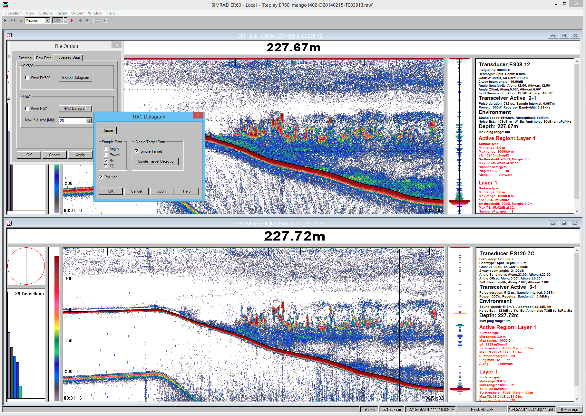
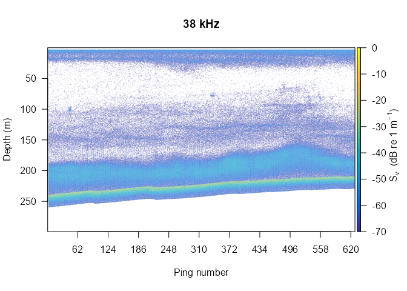
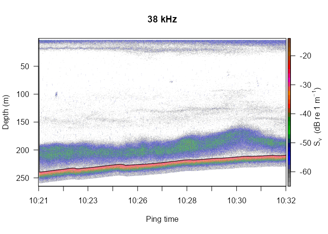
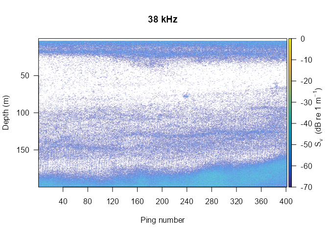
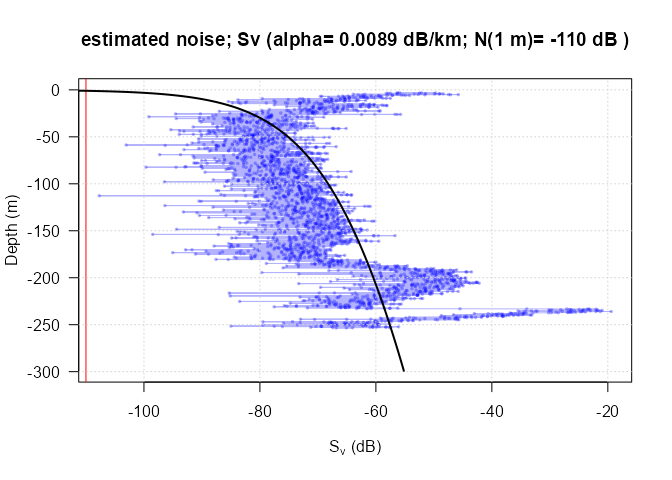
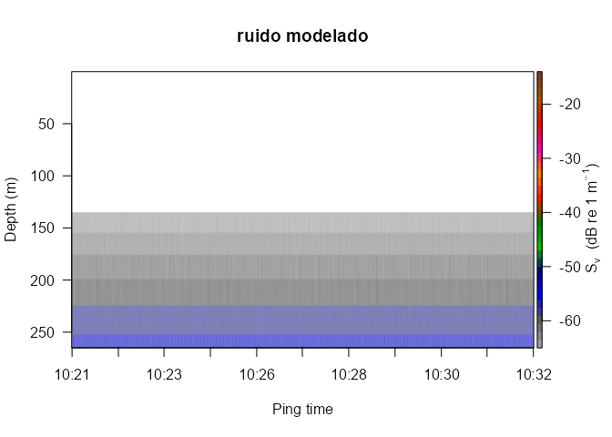
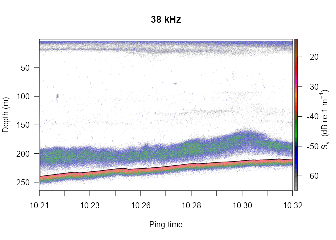
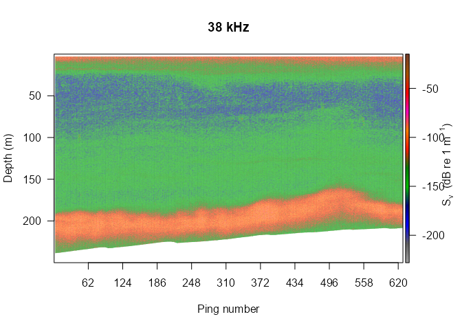
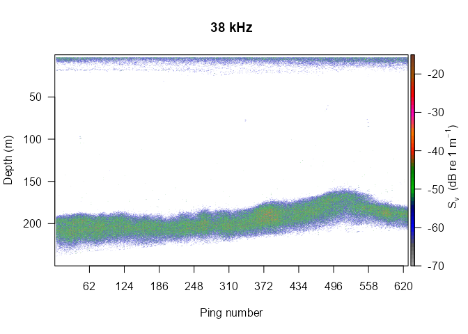

El paquete echogram en R
================
Héctor Villalobos
27/2/23

- <a href="#que-es-un-ecograma-digital"
  id="toc-que-es-un-ecograma-digital">¿Que es un ecograma digital?</a>
  - <a href="#formato-de-datos-crudos-raw"
    id="toc-formato-de-datos-crudos-raw">Formato de datos crudos (raw)</a>
  - <a href="#formato-hac" id="toc-formato-hac">Formato hac</a>
- <a href="#importar-en-r" id="toc-importar-en-r">Importar en R</a>
  - <a href="#archivos-hac" id="toc-archivos-hac">Archivos hac</a>
    - <a href="#posición-geográfica-gps"
      id="toc-posición-geográfica-gps">Posición geográfica (GPS)</a>
    - <a href="#profundidad-del-fondo-detectado"
      id="toc-profundidad-del-fondo-detectado">Profundidad del fondo
      detectado</a>
    - <a href="#importar-ecograma-hac" id="toc-importar-ecograma-hac">Importar
      ecograma hac</a>
  - <a href="#archivos-raw" id="toc-archivos-raw">Archivos raw</a>
    - <a href="#seleccionar-frecuencia"
      id="toc-seleccionar-frecuencia">Seleccionar frecuencia</a>
    - <a href="#seleccionar-tipo-de-datos-sv-ts"
      id="toc-seleccionar-tipo-de-datos-sv-ts">Seleccionar tipo de datos (Sv,
      TS)</a>
    - <a href="#agregar-parámetros-de-calibración-y-ambiente"
      id="toc-agregar-parámetros-de-calibración-y-ambiente">Agregar parámetros
      de calibración y ambiente</a>
- <a href="#visualización" id="toc-visualización">Visualización</a>
- <a href="#recortar-y-blanquear-ecogramas"
  id="toc-recortar-y-blanquear-ecogramas">Recortar y “blanquear”
  ecogramas</a>
- <a href="#eliminar-ruido-de-fondo"
  id="toc-eliminar-ruido-de-fondo">Eliminar ruido de fondo</a>
- <a href="#combinar-frecuencias" id="toc-combinar-frecuencias">Combinar
  frecuencias</a>
- <a href="#apéndice-estructura-de-los-datos-crudos-importados"
  id="toc-apéndice-estructura-de-los-datos-crudos-importados">Apéndice:
  Estructura de los datos crudos importados</a>

# ¿Que es un ecograma digital?

Es la representación visual de una matriz numérica generada por
ecosondas científicas a partir de la emisión de pulsos de sonido
(*pings*) de alta frecuencia y la recepción de los ecos producidos por
organismos acuáticos y el fondo presentes en la trayectoria de los
pulsos.

El escrutinio y análisis de ecogramas es la base de las estimaciones de
biomasa de peces (principalmente pelágicos) mediante métodos de la
acústica pesquera.

## Formato de datos crudos (raw)

Las ecosondas almacenan los datos recabados en un formato diseñado por
el fabricante del equipo. Dados los instrumentos más utilizados (EK500,
EK60), destaca el formato **raw**, de Simrad. En estos archivos queda
registrada toda la información relativa a la configuración del equipo,
la potencia de los ecos recibida ($P_r$), posiciones GPS, etc. Con la
introducción de las ecosondas EK80 el formato **raw** cambió. En este
tutorial nos referiremos principalmente al formato previo.

## Formato hac

El formato **hac**, se ha definido como el estándar adoptado por el
*International Council for the Exploration of the Sea* para el
intercambio de datos acústicos pesqueros (ICES 2005a), sin embargo en la
práctica su uso es más bien limitado. Una posible razón es que este
formato contiene solo una parte de los datos crudos, en particular la
$P_r$ se ha convertido ya en fuerza de retrodispersión por volumen
($S_v$ ) y en fuerza del objetivo acústico ($TS$, por las siglas en
inglés de *Target Strength*), para la cual además se ha aplicado ya un
algoritmo de detección de objetivos aislados (*single targets*).
Cualquier modificación o adecuación de la conversión de $P_r$ en $S_v$ o
$TS$ implica regresar a los archivos **raw** originales.

# Importar en R

## Archivos hac

En `echogram` se han desarrollado tres funciones que pueden extraer
datos del formato **hac**: `position.hac()`, `bottom.hac()` y
`read.echogram()`. Éstas son funciones *wrapper* de las funciones del
paquete `readHAC` (v1.0, Kristensen 2017), desarrollado por Kasper
Kristensen (Technical University of Denmark), que pretenden simplificar
la importación.

Se han probado en datos obtenidos con una ecosonda científica Simrad
EK60. La conversión de archivos **raw** en **hac** se realizó con el
*software* ER60, exportando como *Sample Data* los valores de $S_v$, la
posición geográfica y las detecciones de *Single Targets*.

<figure>

<figcaption aria-hidden="true">Captura de pantalla del <em>software</em>
ER60. Se ilustran las opciones seleccionadas para generar los archivos
<strong>hac</strong> compatibles con <code>echogram</code>.</figcaption>
</figure>

### Posición geográfica (GPS)

La función `position.hac()` requiere como único argumento el nombre del
archivo **hac**. Esta función regresa un *data frame* con la fecha y
hora del GPS (`time.gps`) y del CPU de la PC (`time.cpu`) al momento de
la adquisión de los datos, así como la longitud (`lon`) y latitud
(`lat`) correspondiente. Cada fila del *data frame* representa una
lectura obtenida por el GPS. Si la PC fue configurada con zona horaria
UTC durante la adquisición de datos, entonces `time.gps` y `time.cpu`
serán iguales.

``` r
library(echogram)
hacf <- system.file("extdata", "D20150510-T202221.hac", package = "echogram")
pos <- position.hac(hacf)
head(pos) # ver las primeras filas
```

                 time.gps            time.cpu       lon      lat
    1 2015-05-10 20:22:23 2015-05-10 20:22:23 -110.8760 27.83284
    2 2015-05-10 20:22:25 2015-05-10 20:22:25 -110.8761 27.83285
    3 2015-05-10 20:22:27 2015-05-10 20:22:27 -110.8761 27.83285
    4 2015-05-10 20:22:29 2015-05-10 20:22:29 -110.8762 27.83285
    5 2015-05-10 20:22:31 2015-05-10 20:22:31 -110.8763 27.83286
    6 2015-05-10 20:22:33 2015-05-10 20:22:33 -110.8763 27.83286

A partir de la información anterior, la función `navigation.hac()`
calcula el rumbo de navegación, la distancia navegada, la diferencia de
tiempo y la velocidad de navegación entre cada par de lecturas del GPS.
El cálculo del rumbo y la distancia navegada se realiza mediante
funciones del paquete `geosphere`. Más que su utilización directa, ésta
función es invocada dentro de `read.echogram()`.

### Profundidad del fondo detectado

La función `bottom.hac()` puede importar la profundidad del fondo
detectado (`detBottom`) en cada pulso o emisión de sonido de la
ecosonda, así como el tiempo de la emisión (`pingTime`).

``` r
bot <- bottom.hac(hacf)
head(bot)
```

                 pingTime   detBottom
    1 2015-05-10 20:22:21 2147483.647
    2 2015-05-10 20:22:22 2147483.647
    3 2015-05-10 20:22:23      64.379
    4 2015-05-10 20:22:23      64.504
    5 2015-05-10 20:22:24      64.652
    6 2015-05-10 20:22:24      64.694

Esta función además incorpora otros argumentos que permiten seleccionar
la frecuencia acústica (`channel`) y opcionalmente, si se desea, realiza
un gráfico del perfil del fondo, con la flexibilidad de elegir el límite
máximo de profundidad (`maxDepth`) a visualizar.

``` r
bot <- bottom.hac(hacf, channel = 1, plot = TRUE, maxDepth = -260)
```

### Importar ecograma hac

La función `read.echogram()` hace uso de las tres funciones anteriores y
regresa los datos necesarios para representar un ecograma de $S_v$ en R.
Requiere especificar únicamente el nombre del archivo **hac** y
opcionalmente la frecuencia acústica (`channel`). Si ésta no se
especifica, por defecto corresponde a la frecuencia más baja presente.
Esta función crea un objeto de clase `echogram` (una lista) con los
siguientes componentes:

- `depth`, vector con la profundidad media de cada muestra en m y que
  corresponde a la dimensión vertical de la matriz `Sv`.

- `Sv`, matriz con los valores muestreados, en este caso la fuerza de
  retrodispersión por volumen ($S_v$, en decibeles relativos a 1 m, dB
  re 1 m$^{-1}$). Esta matriz tiene como atributo la frecuencia acústica
  de adquisición de los datos.

- `pings`, *data frame* con información de cada *ping* en el ecograma:
  tiempo de la emisión (`pingTime`), profundidad del fondo detectado (m,
  `detBottom`), velocidad del barco (kn, `speed`), distancia navegada
  acumulada (nmi, `cumdist`). El número de filas de este *data frame*
  representa la dimensión horizontal de la matriz `Sv`.

Sin necesidad de especificarlo, `read.echogram()` puede importar datos
donde la tupla de los pulsos sea de los tipos no comprimidos (U-16,
10030) generados por *software* como el ER60, o comprimidos y
codificados (C-16, 10040) (ICES 2005b) por Movies+ y Movies3D (Berger
et al. 2005). En el segundo caso sin embargo, el tiempo de procesamiento
es considerablemente mayor debido a que no es posible el *parsing*
vectorizado de las tuplas (Com. pers. Kasper Kristensen).

``` r
eco038 <- read.echogram(hacf, channel = 1)
```

Una vez importado, se puede ver la estructura de `eco038`, misma que se
explicó antes.

``` r
str(eco038)
```

    List of 3
     $ depth: num [1:820] 0.0487 0.1461 0.2435 0.341 0.4384 ...
     $ Sv   : num [1:820, 1:316] NA NA NA NA NA ...
      ..- attr(*, "frequency")= chr "38 kHz"
     $ pings:'data.frame':  316 obs. of  4 variables:
      ..$ pingTime : POSIXct[1:316], format: "2015-05-10 20:22:21" "2015-05-10 20:22:22" ...
      ..$ detBottom: num [1:316] 2.15e+06 2.15e+06 6.44e+01 6.45e+01 6.47e+01 ...
      ..$ speed    : num [1:316] 0 0 0 0 6.45 ...
      ..$ cumdist  : num [1:316] 0 0 0 0 0.000896 ...
     - attr(*, "class")= chr "echogram"

De este objeto se pueden extraer sus diferentes elementos de la manera
habitual, por ejemplo, la tabla de información de los pings:

``` r
head(eco038$pings)
```

                 pingTime   detBottom    speed      cumdist
    1 2015-05-10 20:22:21 2147483.647 0.000000 0.0000000000
    2 2015-05-10 20:22:22 2147483.647 0.000000 0.0000000000
    3 2015-05-10 20:22:23      64.379 0.000000 0.0000000000
    4 2015-05-10 20:22:23      64.504 0.000000 0.0000000000
    5 2015-05-10 20:22:24      64.652 6.454695 0.0008964854
    6 2015-05-10 20:22:24      64.694 6.454695 0.0017929708

## Archivos raw

En el caso de datos generados por la EK60, cada archivo **raw** se
acompaña de otros dos con el mismo nombre pero diferente extensión:
**idx** y **bot**. Existe una función dedicada para importar cada uno de
ellos.

El archivo **idx** contiene información para cada ping (fecha/hora,
número de ping, distancia navegada, latitud, longitud, …).

``` r
idx <- read.EK_idx("./Data/mango1402-D20140223-T172151.idx")
head(idx)
```

                 pingTime pingNumber vesselDistance      lat       lon offset
    1 2014-02-23 17:21:51          1       2.315000 30.11603 -114.2928   1220
    2 2014-02-23 17:21:52          2       2.315000 30.11960 -114.2629  26536
    3 2014-02-23 17:21:53          3       2.315000 30.11960 -114.2629  51780
    4 2014-02-23 17:21:54          4       2.315000 30.11958 -114.2630  77096
    5 2014-02-23 17:21:55          5       2.322363 30.11957 -114.2630 102384
    6 2014-02-23 17:21:56          6       2.324890 30.11955 -114.2631 127700

Por otra parte, **bot** contiene el fondo detectado para cada
frecuencia, indexado por cada ping.

``` r
bot <- read.EK_bot("./Data/mango1402-D20140223-T172151.bot")
head(bot)
```

                 pingTime depth.tr1 depth.tr2
    1 2014-02-23 17:21:51    0.0000    0.0000
    2 2014-02-23 17:21:52    0.0000    0.0000
    3 2014-02-23 17:21:53  239.6742  239.6005
    4 2014-02-23 17:21:54  239.6008  239.5643
    5 2014-02-23 17:21:55  239.5258  239.4356
    6 2014-02-23 17:21:56  239.3911  239.4244

En cuanto a la importación de los archivos **raw**, esta se completa en
dos pasos. Primero se importan todos los datos con la función
`read.EK60_raw()` y posteriormente se convierten en un objeto de la
clase `echogam`,explicada antes, con la función `ek2echogram()`.

``` r
ekraw <- read.EK60_raw("./Data/mango1402-D20140223-T172151.raw")
eco1 <- ek2echogram(ekraw)
```

Como dijimos, en ekraw se importó toda la información contenida en el
archivo raw, por lo que al momento de convertir a la clase echogram se
pueden cambiar las opciones por defecto por medio de los argumentos de
la función `ek2echogram()`:

``` r
args(ek2echogram)
```

    function (ekraw, frequency = 1, data = "Sv", environment = NULL, 
        calibration = NULL) 
    NULL

### Seleccionar frecuencia

Primero, podemos ver cuantas frecuencias hay en nuestros datos
explorando en la información de configuración.

``` r
ekraw$configuration$Transceiver$frequency
```

    [1]  38000 120000

Así, para convertir a la clase `echogram` los datos de 120 kHz,
ejecutamos:

``` r
eco2 <- ek2echogram(ekraw, frequency = 2) 
attributes(eco2$Sv)[2]
```

    $frequency
    [1] "120 kHz"

### Seleccionar tipo de datos (Sv, TS)

Por defecto, en la conversión se producen los valores de $S_v$ mediante
la ecuación:

$$
S_V(R, P_r) = P_r + 20log(R) + 2\alpha R - 10log\Bigg(\frac{P_t G_0^2 \lambda ^2}{16 \pi^2}\Bigg) -10log\Bigg(\frac{c \tau \psi}{2}\Bigg) -2 S_a\;corr
$$

donde:

$R$ es la profundidad de la muestra,

$\alpha$ es el coeficiente de absorción,

$P_t$ es la potencia transmitida,

$G_0$ es la ganancia (linearizada),

$\lambda$ es la longitud de onda,

$c$ es la velocidad del sonido,

$\tau$ es la longitud del pulso y

$S_a\, corr$ es la corrección del $s_a$ obtenida de la calibración de la
ecosonda.

También podemos obtener los valores de $TS$ (dB re 1 m$^{2}$)
especificando `data = TS`, lo cual se calcula mediante:

$$
TS(R, P_r) = P_r + 40log(R) + 2\alpha R - 10log\Bigg(\frac{P_t G_0^2 \lambda ^2}{16 \pi^2}\Bigg)
$$

``` r
ecoTS <- ek2echogram(ekraw, data = "TS")
attributes(ecoTS$Sv)
```

    $dim
    [1] 3093  628

    $frequency
    [1] "38 kHz"

    $variable
    [1] "TS"

### Agregar parámetros de calibración y ambiente

Como sabemos, las condiciones del ambiente (temperatura y salinidad) al
momento de la colecta de los datos afectan a $c$ y a $\alpha$, lo que a
su vez repercute en el cálculo de $R$ y $\lambda$, y por consiguiente en
los valores de $S_v$ y $TS$. Cuando no se especifican, esos valores se
toman de lo que está almacenado en el archivo **raw**, sin embargo, es
posible indicar valores diferentes cuando se cuenta con datos más
adecuados.

``` r
eco1 <- ek2echogram(ekraw, frequency = 1,
              environment = list(soundVelocity = 1511.12, absorptionCoeff = 0.0089),
              calibration = list(gain = 21.35, saCorr = -0.68))
```

# Visualización

En el tutorial de ayer se presentaron algunos ejemplos de visualización
de ecogramas, así como los argumentos disponibles para personalizar la
figura por defecto que se obtiene al indicar únicamente el ecograma que
se quiere ver (e.g. `echogram(eco1)`).

``` r
# Argumentos de la función echogram()
args(echogram)
```

    function (echogram, Svthr = -70, Svmax = 0, col.sep = NULL, col.nb = NULL, 
        scheme = NULL, depth.grid = NULL, x.grid = NULL, x.ref = c("pings", 
            "nmi", "seconds"), seabed = FALSE, depth.max = NULL, 
        ping.ini = NULL, ping.max = NULL, colbar = TRUE, main = NULL, 
        tformat = "%H:%M", ...) 
    NULL

Para ilustrar esto, al igual que antes, convertimos el `pingTime` a hora
local, guardamos el fondo detectado del archivo **bot** en el ecograma y
aplicamos una máscara para “blanquear” datos de los primeros 3 m de la
superficie y por debajo de 20 m del fondo.

``` r
library(lubridate)
```


    Attaching package: 'lubridate'

    The following objects are masked from 'package:base':

        date, intersect, setdiff, union

``` r
eco1$pings$pingTime <- with_tz(eco1$pings$pingTime, tzone = "America/Hermosillo")
eco1$pings$detBottom <- bot$depth.tr1
eco2$pings$detBottom <- bot$depth.tr1 # esto porque lo necesitaremos más adelante
eco1 <- mask.echogram(eco1, surf.off = 3, bott.off = -20)
```

Ahora, el ecograma por por defecto y el personalizado se obtendrían así:

``` r
echogram(eco1)
```



``` r
echogram(eco1, Svthr = -65, Svmax = -15, col.sep = 1.5, scheme = "EK500", x.ref = "s", depth.max = 265, seabed = TRUE)
```



# Recortar y “blanquear” ecogramas

Antes ya mostramos la función `mask.echogram()` que permite borrar parte
de los datos (haciéndolos NA). Esto puede tener usos más allá de la
simple representación visual ejemplificada antes. Al quitar los ecos del
fondo podemos aplicar análisis bi- o multi-frecuencia, que implican la
combinación (sumas o restas) de valores de $S_v$ para distinguir mejor a
cierto grupo de organismos con base en sus características reflexivas.
Más sobre esto un poco más adelante.

También podemos “recortar” un ecograma verticalmente hasta cierta
profundidad, y horizontalmente entre un ping inicial y un ping final.
Esto se hace con la función `trim.echogram()`.

``` r
eco.trim <- trim.echogram(eco1, depth.max = 200, ping.ini = 100, ping.end = 500)
echogram(eco.trim)
```



# Eliminar ruido de fondo

Para eliminar el ruido de fondo (*background noise*) podemos utilizar el
modelo propuesto por De Robertis y Higginbottom (2007). Sin entrar en
los detalles, el proceso consiste en modelar el ruido en un ecograma lo
más limpio posible (idealmente con la ecosonda funcionan en modo pasivo)
y donde se tenga grabado un buen tramo por debajo del fondo. **En este
ejemplo no se cumplen estas condiciones, por lo que solo será
ilustrativo de la técnica**.

``` r
noise38 <- noise.echogram(eco1, ping = 100, dB1m = -110,alpha = 0.0089, out = TRUE)
```



``` r
echogram(noise38, Svthr = -65, Svmax = -15, col.sep = 1.5, scheme = "EK500", x.ref = "s", depth.max = 265, main = "ruido modelado")
```



Ahora restamos el ruido modeloda al ecograma original.

``` r
eco1.nr <- add.echogram(eco1, noise38, operator = "minus", domain = "linear")
```

    Warning in linear2dB(ans0): NaNs produced

``` r
echogram(eco1.nr, Svthr = -65, Svmax = -15, col.sep = 1.5, scheme = "EK500", x.ref = "s", depth.max = 265, seabed = TRUE)
```



# Combinar frecuencias

EL ecograma que hemos venido utilizando corresponde a un lance de pesca
donde se capturó merluza del Pacífico (*Merluccius productus*). Vamos a
ilustrar como se combinan las dos frecuencias disponibles con la idea de
resaltar mejor la capa demersal que corresponde a la merluza.

Primero vamos a eliminar completamente los ecos de fondo y los primeros
3 m desde la superficie.

``` r
eco1m <- mask.echogram(eco1, surf.off = 3, bott.off = 0.3, mask = TRUE)
eco2m <- mask.echogram(eco2, surf.off = 3, bott.off = 0.3, mask = TRUE)
```

Ahora sumaremos las dos frecuencias

``` r
eco.sum <- add.echogram(eco1m, eco2m, operator = "plus", domain = "dB")
echogram(eco.sum, Svthr = -228, Svmax = -15, scheme = "EK500", depth.max = 250)
```



De ahí, restaría elegir un valor umbral que separe los ecos que nos
interesan. En este caso, tenemos una buena idea de que ronda los -120 dB
re 1 m$^{-1}$. A partir de este umbral se genera una máscara para los
valores superiores, y al aplicar la mascara en el ecograma original de
38 kHz tendremos el resultado final.

``` r
masc <- eco.sum$Sv > -120
eco1f <- eco1m
eco1f$Sv <- eco1f$Sv * masc
eco1f$Sv[eco1f$Sv == 0] <- NA
echogram(eco1f, Svthr = -70, Svmax = -15, scheme = "EK500", depth.max = 250)
```



# Apéndice: Estructura de los datos crudos importados

Cuando importamos un archivo **raw** se produce una lista de tres
elementos que contienen la información de configuración, las sentencias
NMEA recibidas por el gps y los datos acústicos.

``` r
names(ekraw)
```

    [1] "configuration" "nmea"          "pings"        

A su vez, `configuration` consta de dos elementos:

``` r
names(ekraw$configuration)
```

    [1] "Header"      "Transceiver"

El encabezado, tiene información sobre la fecha inicial, nombre de la
campaña, del transecto, de la ecosonda, versión del *software* y número
de tranceptores.

``` r
ekraw$configuration$Header
```

                   dgTime surveyName transectName sounderName version
    1 2014-02-23 17:21:51  Mango1402                     ER60   2.4.3
      transceiverCount
    1                2

Por otro lado, en `Transceiver` se incluye información de cada
transductor.

``` r
ekraw$configuration$Transceiver
```

                                  channelId beamType frequency gain   EBA
    1  GPT  38 kHz 009072057055 2-1 ES38-12        1     38000   21 -15.5
    2 GPT 120 kHz 009072068b22 3-1 ES120-7C        1    120000   27 -21.0
      beamwidthAlongship beamwidthAthwartship angleSensitivityAlongship
    1               12.5                 12.5                      12.5
    2                7.0                  7.0                      23.0
      angleSensitivityAthwartship angleOffsetAlongship angleOffsetAthwartship posx
    1                        12.5                    0                      0    0
    2                        23.0                    0                      0    0
      posy posz dirx diry dirz pulseLengthT spare2        gainT spare3      saCorrT
    1    0    0    0    0    0 0.000255....        19, 21, ....        0, 0, 0,....
    2    0    0    0    0    0 6.399999....        25.5, 26....        0, 0, 0,....
      spare4
    1 070413
    2 070413

El segundo elemento de la lista contiene las sentencias NMEA, que se
refieren al protocolo de la *National Marine Electronics Association*
para los datos de GPS.

``` r
head(ekraw$nmea)
```

                   dgTime
    1 2014-02-23 17:21:51
    2 2014-02-23 17:21:52
    3 2014-02-23 17:21:52
    4 2014-02-23 17:21:52
    5 2014-02-23 17:21:52
    6 2014-02-23 17:21:52
                                                                      string
    1                                                 $SDVLW,2.315,N,2.315,N
    2     $GPRMC,161948,A,3007.1759,N,11415.7727,W,9.1,254.2,230214,11.9,E,A
    3 $GPRMB,A,0.06,R,,1811 43M,3005.9690,N,11424.7860,W,7.904,261.2,9.0,V,A
    4       $GPGGA,161948,3007.1759,N,11415.7727,W,1,11,0.8,-0.1,M,-34.3,M,,
    5                             $GPGLL,3007.1759,N,11415.7727,W,161948,A,A
    6                                       $GPBOD,260.9,T,249.0,M,1811 43M,

La función `parse.nmea()` busca y prueba a convertir la sentencia GPRMC,
pero si falla el usuario puede intentar con una diferente.

``` r
pos <- parse.nmea(ekraw$nmea)
head(pos)
```

                 time.cpu            time.gps       lon      lat bearing speed
    1 2014-02-23 17:21:52 2014-02-23 16:19:48 -114.2629 30.11960   254.2   9.1
    2 2014-02-23 17:21:54 2014-02-23 16:19:50 -114.2630 30.11958   254.7   9.1
    3 2014-02-23 17:21:56 2014-02-23 16:19:52 -114.2631 30.11955   255.2   9.1
    4 2014-02-23 17:21:58 2014-02-23 16:19:54 -114.2632 30.11953   256.5   9.1
    5 2014-02-23 17:22:00 2014-02-23 16:19:56 -114.2633 30.11952   258.3   9.1
    6 2014-02-23 17:22:02 2014-02-23 16:19:58 -114.2634 30.11950   260.1   9.1

Como antes, `time.gps` y `time.cpu` revelan si la hora de la PC de
adquisición estaba configurada correctamente en UTC. En este caso se
advierte una diferencia de 1 hora con 2 minutos adelante de la hora UTC
proporcionada por el GPS.

El tercer y último elemento de los datos crudos contiene a su vez tres
cosas.

``` r
names(ekraw$pings)
```

    [1] "sampleData" "Pr"         "angles"    

`sampleData`, con la siguiente información, para cada ping y frecuencia
en los datos:

``` r
ekraw$pings$sampleData[1, , ]
```

                                38000       120000
    pingTime             1.393176e+09 1.393176e+09
    channel              1.000000e+00 2.000000e+00
    mode                 3.000000e+00 3.000000e+00
    transducerDepth      0.000000e+00 0.000000e+00
    frequency            3.800000e+04 1.200000e+05
    transmitPower        1.000000e+03 5.000000e+02
    pulseLength          5.120000e-04 5.120000e-04
    bandWidth            3.275100e+03 5.557126e+03
    sampleInterval       1.280000e-04 1.280000e-04
    soundVelocity        1.515657e+03 1.515657e+03
    absorptionCoeff      8.511835e-03 4.425454e-02
    heave                0.000000e+00 0.000000e+00
    roll                 0.000000e+00 0.000000e+00
    pitch                0.000000e+00 0.000000e+00
    temperature          1.000000e+01 1.000000e+01
    trawlUpperDepthValid 0.000000e+00 0.000000e+00
    trawlOpeningValid    0.000000e+00 0.000000e+00
    trawlUpperDepth      0.000000e+00 0.000000e+00
    trawlOpening         0.000000e+00 0.000000e+00
    offset               0.000000e+00 0.000000e+00
    count                3.093000e+03 3.093000e+03

Un arreglo de tres dimensiones con la potencia recibida (`Pr`, *received
power*) para cada muestra, en cada ping y cada frecuencia.

``` r
dim(ekraw$pings$Pr)
```

    [1] 3093  628    2

Y finalmente, cuando se tienen datos de transductores de haz dividido,
un arreglo de cuatro dimensiones con los ángulos para cada muestra, en
cada ping y cada frecuencia.

``` r
dim(ekraw$pings$angles)
```

    [1] 3093  628    2    2

<div id="refs" class="references csl-bib-body hanging-indent">

<div id="ref-Berger2005" class="csl-entry">

Berger, Laurent, Christophe Durand, Claude Marchalot, y Noël Diner.
2005. «MOVIES+ User Manual version 4.3». DNIS/ESI/DLE/DTI/00-051.
IFREMER.

</div>

<div id="ref-DeRobertis2007" class="csl-entry">

De Robertis, Alex, y Ian Higginbottom. 2007. «A post-processing
technique to estimate the signal-to-noise ratio and remove echosounder
background noise». *ICES Journal of Marine Science* 64: 1282-91.
<https://doi.org/10.1093/icesjms/fsm112>.

</div>

<div id="ref-ICES2005a" class="csl-entry">

ICES. 2005a. «Description of the ICES *HAC* Standard Data Exchange
Format, Version 1.60». 278. ICES Cooperative Research Report.

</div>

<div id="ref-ICES2005b" class="csl-entry">

———. 2005b. «Report of the Planning Group on the HAC Data Exchange
Format (PGHAC)». International Council for the Exploration of the Sea.

</div>

<div id="ref-Kristensen2017" class="csl-entry">

Kristensen, Kasper. 2017. *readHAC: Read Acoustic HAC Format*.
<https://CRAN.R-project.org/package=readHAC>.

</div>

</div>
