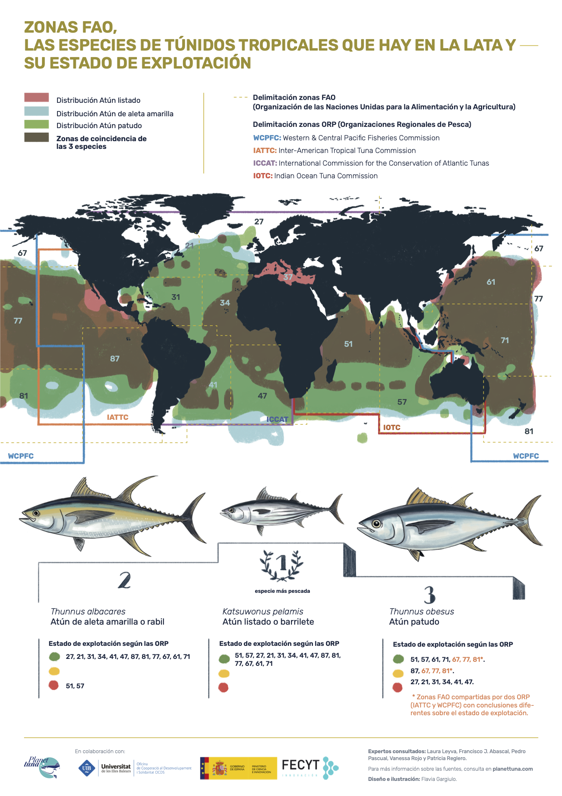

```{r librerías}
library(data.table)
library(reshape2)
library(RODBC)
library(geosphere)
library(terra)
library(sp)
library(ggplot2)
library(dplyr)
library(maps)
library(gridExtra)
library(raster)
library(grid)
```

## Introducción a los túnidos tropicales

Aquí trabajaremos con datos de capturas pesqueras de túnidos tropicales, capturados con pesca de cerco. 

La pesca de cerco se realiza a travé de dos dipos de operaciónes:
a) A través de Dispositivos de Concentración de Peces (DCP) o en inglés Fisheries Aggregation Devices (FAD) 
b) Banco libre, sin el uso de dispositivos adicionales


En la página de ICCAT, la *COMISIÓN INTERNACIONAL para la CONSERVACIÓN del ATÚN ATLÁNTICO* <https://www.iccat.int/es/> podéis encontrar mucha información sobre las estadísticas que proporcionan y cómo las utilizan para manejar las poblaciones de túnidos en el Océano Atlántico. 

En esta ocasión, trabajaremos con datos de captura y esfuerzo de la pesquería de cerco tropical entre 1991 y 2022. Aquí hay datos de capturas de tres especies de túnidos tropicales:

SKJ Skipjack Katsuwonus pelamis, atún listado
YFT Yellowfin tuna, Thunnus albacares, atún de aleta amarilla o rabil
BET Bigeye tuna, Thunnus obesus, atún patudo 

La página web de *Planet Tuna* realiza divulgación científica entorno a los túnidos: <https://planettuna.com/articulos/#ciencia> para ampliar información.

setwd("~/Desktop/VICENÇ MUT inicio/OHW Intercoonecta/Talleres avanzados y Hackaton/Taller Marina Avanzado/Marina - captura túnidos tropicales")
{fig-align="center" width="266"}

## Datos de ICCAT

Los datos ya han sido descargados de ICCAT y se han subido a este github para que no perdamos tiempo teniendo que descargarlos. Aunque este proceso es rápido y sencillo.  

No obstante aquí os dejo los pasos escritos de la descarga de datos: 
- Entrar https://www.iccat.int/es/ 
- Entrar en 'Estadísticas' y entrar en 'Acceso a las bases de datos estadísticos de ICCAT'
- Entrar en 'Estadísticas de captura y muestreo biológico'
- Hacer click en 'Captura/esfuerzo de Tarea 2 por tipo de operación [DCP/banco libre] (solo tropicales)' y se descargan los datos en excel. 
- Para trabajar con R, yo prefiero eliminar con excel las cabeceras, dejar solo el nombre de cada columna y guardar el fichero como ".cvsv" (delimitado por comas)

A continuación cargamos los datos y empezamos a trabajar con ellos:

```{r cargar datos}
# para cargar en un ordenador local, reemplazar por la ruta de tu ordenador
load("~/Desktop/VICENÇ MUT inicio/OHW Intercoonecta/Talleres avanzados y Hackaton/Taller Marina Avanzado/Marina - captura túnidos tropicales/.RData")

# para cargar en github, será necesario abrir la ruta correspondiente
# load("~/Desktop/VICENÇ MUT inicio/OHW Intercoonecta/Talleres avanzados y Hackaton/Taller Marina Avanzado/Marina - captura túnidos tropicales/.RData")

# Establecemos el escritorio de trabajo
setwd("~/Desktop/VICENÇ MUT inicio/OHW Intercoonecta/Talleres avanzados y Hackaton/Taller Marina Avanzado/Marina - captura túnidos tropicales")

# abrimos los datos como .csv
# como tiene cabecera, indicamos: header = TRUE
# y sepaación como punto y coma: sep = ";". Es posible que en tu ordenadro de errores y debas cambiar ";" por una coma ","

dat_ICCAT <- read.csv("~/Desktop/VICENÇ MUT inicio/OHW Intercoonecta/Talleres avanzados y Hackaton/Taller Marina Avanzado/Marina - captura túnidos tropicales/t2ce_ETRO-PS1991-22_bySchool_v1.csv", header=T, sep = ";")

names(dat_ICCAT)
```

## Visualizar qué contienen estos datos 

Con la función `str()` podemos ver la estructura de `dat_ICCAT` y sus diferentes componentes.

```{r cargar datos}
str(dat_ICCAT) # aquí podemos ver cuál es la clase de cada una de las columnas que tenemos

head(dat_ICCAT) # vemos que hay mucha información, pero no necesitamos todas las columnas

# Por ello, eliminamos las siguientes columnas. No aportan la información que más nos interesa:
dat_ICCAT <- subset(dat_ICCAT, select = -c(DSetID, StrataID, GearCode, Decade,
                               Eff1, Eff1Type, Eff2, Eff2Type, Eff3, Eff3Type,
                               Eff4, Eff4Type, Eff5, Eff5Type, ALB, BLF, LTA, FRI, TOTAL))

head(dat_ICCAT) # y comprobamos que es correcto

# Ahora renombramos las columnas para entender mejor que nos indican
names(dat_ICCAT)[names(dat_ICCAT) == "Flag"] <- "Bandera_pais"
names(dat_ICCAT)[names(dat_ICCAT) == "FishMode"] <- "Tipo_pesca"

# y comprobamos que se ha cambiado
head(dat_ICCAT)

```

Según la información que proporciona ICCAT en la página <https://www.iccat.int/es/accesingdb.html> en el documento 'Información publicada sobre captura y esfuerzo de Tarea 2 (T2CE)' se indica que: “La composición completa de la captura por especies (túnidos, especies afines y tiburones) (en peso (kg) y/o en número de peces) obtenida por una determinada cantidad de esfuerzo (valor absoluto) en un nivel determinado de detalle o estratificación (estrato). El nivel de estratificación define la “forma específica” de la T2CE. El Comité Permanente de Investigación y Estadísticas (SCRS) requiere que los datos de T2CE sean enviados cada año por flota y arte, con el siguiente nivel de estratificación espacial/temporal, como mínimo:
- Tiempo: mes
- Área: cuadrículas de 1x1 grado (todos los artes de superficie) y cuadrículas de 5x5 grados (artes de
palangre)"

Ahora vamos a ver cómo se ve esto dentro de cada columna del fichero. Para ello utilizamos la función `"levels"` para saber cuáles son las categorías dentro de un factor. Con la función `"table"`

```{r qué información hay}
levels(dat_ICCAT$Bandera_pais) # Aquí vemos que hay información de muchos países, entre ellos, Guatemala, Curaçao, El Salvador, Panamá, Venezuela, San Vicente y las Islas Granadinas y España"

table(dat_ICCAT$Bandera_pais) # Aquí vemos el número de datos que hay para cada país

table(dat_ICCAT$YearC) # Aquí vemos el número de datos que hay para año, y para todos los países

table(is.na(dat_ICCAT$SKJ)) # aquí vemos si hay valores NA, que no los hay 
table(is.na(dat_ICCAT$BET)) # aquí vemos si hay valores NA, que no los hay 
table(is.na(dat_ICCAT$YFT)) # aquí vemos si hay valores NA, que no los hay 

# Aquí hay datos de capturas de túnidos tropicales
# SKJ Skipjack Katsuwonus pelamis, atún listado
# YFT Yellowfin tuna, Thunnus albacares, atún de aleta amarilla o rabil
# BET Bigeye tuna, Thunnus obesus, atún patudo 

# Haremos un scatter plot para ver cómo se distibuyen los datos de capuras, en Kgs

plot(dat_ICCAT$YFT, main="YFT - Thunnus albacares,atún de aleta amarilla o rabil (Kg)")
plot(dat_ICCAT$BET, main="BET - Thunnus obesus, atún patudo (Kg)")
plot(dat_ICCAT$SKJ, main= "SKJ - Katsuwonus pelamis, atún listado (Kg)")

# Haremos un histograma para ver cómo se distibuyen los datos de capuras, en Kgs
hist(dat_ICCAT$YFT, main="YFT - Thunnus albacares,atún de aleta amarilla o rabil")
hist(dat_ICCAT$BET, main="BET - Thunnus obesus, atún patudo")
hist(dat_ICCAT$SKJ, main= "SKJ - Katsuwonus pelamis, atún listado")

```

## Realizar gráficos 

Dibujar los datos en un gráfico o plot

```{r}
# Extraer la columna años, y crear un vector
years <- dat_ICCAT$YearC

# Crear el histograma año a año
histograma <- ggplot(data = NULL, aes(x = years)) +
  geom_histogram(binwidth = 1, fill = "skyblue", color = "black") +
  labs(title = "ICCAT Frequency per Year", x = "Year", y = "Frequency") +
  theme_minimal()

# Dibujar el histograma
print(histograma)

```

Calcular la suma de todas las especies
```{r}
# Para trabajar con el total de capturas de especies de túnidos, calculamos la suma de todos los túnidos tropicales 'SKJ', 'BET', and 'YFT' y añadimos una columna llamada "todotrop"

head(dat_ICCAT)
1180  + 4590  + 10440  # esto es igual a = 16210

dat_ICCAT$todotrop <- rowSums(dat_ICCAT[, c('SKJ', 'BET', 'YFT')])

head(dat_ICCAT) # comprobamos que es correcto

# Con la función aggegate, y la función FUN = sum, calculas el total para cada año y para tipo de pesca
suma_anual_todotrop <- aggregate(todotrop ~ YearC + Tipo_pesca, data = dat_ICCAT, FUN = sum)

# Dispositivos de Concentración de Peces (DCP)

ggplot(suma_anual_todotrop, aes(x = YearC, y = todotrop, color = Tipo_pesca)) +
  geom_line() +
  scale_color_manual(values = c("FAD" = "red", "FSC" = "blue", "n/a" = "green"), labels = c("DCP", "Banco libre", "n/a")) + # Manually specify colors and labels
  labs(title = "ICCAT Capturas totales anuales en el Atlántico",
       x = "Año",
       y = "Suma de las tres especies",
       color = "Tipo de pesca") +
  theme_minimal()

```

Datos para barco en función de su bandera

```{r}
# Así podemos visualizar todos los datos que hay disponibles por cada país
ggplot(dat_ICCAT, aes(x = YearC, y = todotrop, color = Bandera_pais)) +
  geom_point() 

#Con la función aggegate, y la función FUN = sum, calculas el total para cada año y para tipo de pesca
suma_anual_todotrop_banderas <- aggregate(todotrop ~ YearC + Bandera_pais, data = dat_ICCAT, FUN = sum)

# Dispositivos de Concentración de Peces (DCP)

ggplot(suma_anual_todotrop_banderas, aes(x = YearC, y = todotrop, color = Bandera_pais)) +
  geom_line() +
  theme_minimal()

```

## Convertir coordenadas para hacer mapas 

La estratificación espacial puede oscilar entre cuadrículas de 1x1 grado hasta grandes zonas geográficas
(ver los tipos de cuadrículas en <http://www.iccat.int/Forms/CODES_SquareTypes.xls>
GeoStrataCode: es un código que contiene información sobre divisiones geográficas, con un formato como número x número.

```{r}
gsub('x.*','',dat_ICCAT$GeoStrataCode)
```

Encuentra todo lo que sigue a la letra x y lo reemplaza con nada (''), dejando solo el número anterior.
Esto da el ancho de la celda en la dirección de latitud (cellatwidth). gsub('.*x','',dat_ICCAT$GeoStrataCode):

Encuentra todo lo que está antes de la letra x (incluida la x) y lo reemplaza con nada.
Esto da el ancho de la celda en la dirección de longitud (cellonwidth). as.numeric: Convierte los resultados en números.


```{r}
# Convertimos posiciones de latitud y longitud a decimal
dat_ICCAT$cellatwidth <- as.numeric(gsub('x.*','',dat_ICCAT$GeoStrataCode)) # para reemplazar un mismo patrón
dat_ICCAT$cellonwidth <- as.numeric(gsub('.*x','',dat_ICCAT$GeoStrataCode))

head(dat_ICCAT) # vemos que se añadido 

```

QuadID: identifica el cuadrante geográfico. Generalmente, los cuadrantes están numerados:
1: Norte-Este.
2: Norte-Oeste.
3: Sur-Oeste.
4: Sur-Este.

```{r}
ifelse(dat_ICCAT$QuadID %in% c(1,2), 1, -1)
```

Si el cuadrante está en 1 o 2 (Norte), el signo es positivo (1).
Si no (cuadrantes 3 o 4, Sur), el signo es negativo (-1).

```{r}
dat_ICCAT$Lon + dat_ICCAT$cellonwidth / 2
```

Se toma el valor central de la celda longitudinal añadiendo la mitad del ancho de la celda (cellonwidth).
El cálculo completo da la longitud en formato decimal.

```{r}
dat_ICCAT$londec<-ifelse(dat_ICCAT$QuadID %in% c(1,2),1,-1)*(dat_ICCAT$Lon+dat_ICCAT$cellonwidth/2)
dat_ICCAT$latdec<-ifelse(dat_ICCAT$QuadID %in% c(1,4),1,-1)*(dat_ICCAT$Lat+dat_ICCAT$cellatwidth/2)

# Eliminamos las columnas que ya no vamos a necesitar
dat_ICCAT <- subset(dat_ICCAT, select = -c(GeoStrataCode, QuadID, Lat, Lon, xLon, yLat, cellatwidth, cellonwidth ))

head(dat_ICCAT)

```

Si dibujamos las coordenadas podemos ver las localizaciones de los datos que tenemos en el Océano Atlántico

```{r}

plot(dat_ICCAT$londec, dat_ICCAT$latdec, pch = 16, cex = .9, col = 'goldenrod1', xlab = "Longitude", ylab = "Latitude", main = "ICCAT Capturas de túnidos tropicales")
```

## Otra información importante: 

Es importante leer cuál es la fuente de tus datos para, en primer lugar, entenderlo. 

Según ICCAT, la cobertura de la captura por especies (proporción de la captura total de Tarea 1 representada por T2CE) puede
variar desde un mínimo del 5% hasta casi el 100%, dependiendo de muchos factores.
 
Otros problemas que deben tenerse en cuenta son, según la información que proporciona ICCAT es que:

‐ En muchos conjuntos de datos falta la cantidad de esfuerzo pesquero (no declarado) y dichos registros podrían ser inutilizables en los análisis detallados de CPUE.

‐ En muchos conjuntos de datos podría existir una declaración incompleta de toda la composición por especies (en la que las especies objeto de captura fortuita podrían no estar bien representadas) obtenida
por una cantidad de esfuerzo pesquero determinada.

‐ En muchas series temporales hay una gran heterogeneidad de unidades de esfuerzo pesquero dentro del mismo arte pesquero.

‐ Varios conjuntos de datos tienen capturas por especies ya extrapoladas a la captura global de Tarea 1, de tal forma que la cobertura de muestreo original no puede ser determinada.

‐ En algunos conjuntos de datos el esfuerzo pesquero se contabiliza “dos veces”. Esto sucede cuando, para la misma pesquería, se declara a ICCAT más de un conjunto de datos con composiciones parciales de la captura por especies (a menudo estratificadas de forma diferente) en diferentes envíos de datos.
