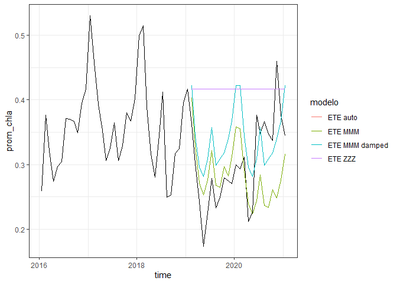

Datos temporales en R
================
Denisse Fierro Arcos
2023-02-25

- <a href="#analisis-de-datos-temporales-en-r"
  id="toc-analisis-de-datos-temporales-en-r">Analisis de datos temporales
  en <code>R</code></a>
  - <a href="#llamando-paquetes-relevantes"
    id="toc-llamando-paquetes-relevantes">Llamando paquetes relevantes</a>
  - <a href="#buscando-y-bajando-datos-desde-erddap"
    id="toc-buscando-y-bajando-datos-desde-erddap">Buscando y bajando datos
    desde ERDDAP</a>
  - <a href="#visualizando-datos" id="toc-visualizando-datos">Visualizando
    datos</a>
  - <a href="#analisis-de-series-de-tiempo"
    id="toc-analisis-de-series-de-tiempo">Analisis de series de tiempo</a>
    - <a href="#decomponiendo-series-de-tiempo"
      id="toc-decomponiendo-series-de-tiempo">Decomponiendo series de
      tiempo</a>
  - <a href="#pronosticando-clorofila-en-las-aguas-de-guatemala"
    id="toc-pronosticando-clorofila-en-las-aguas-de-guatemala">Pronosticando
    clorofila en las aguas de Guatemala</a>

# Analisis de datos temporales en `R`

Aqui describimos como explorar y analizar series de tiempo en `R` para
poder entender mejor los patrones temporales en nuestros datos. Este
tipo de analisis tambien pueden ser utilizados para predecir como una
variable podria variar en el futuro basado en su variacion en el pasado.

Para este ejercicio vamos a usar datos disponibles de manera libre a
traves del servidor [ERDDAP](http://erddap.com/) utilizando el paquete
`rerddap`.

## Llamando paquetes relevantes

``` r
library(tidyverse) #Incluye a ggplot2
```

    ## ── Attaching packages ─────────────────────────────────────── tidyverse 1.3.2 ──
    ## ✔ ggplot2 3.4.0     ✔ purrr   1.0.1
    ## ✔ tibble  3.1.8     ✔ dplyr   1.1.0
    ## ✔ tidyr   1.3.0     ✔ stringr 1.5.0
    ## ✔ readr   2.1.2     ✔ forcats 0.5.2
    ## ── Conflicts ────────────────────────────────────────── tidyverse_conflicts() ──
    ## ✖ dplyr::filter() masks stats::filter()
    ## ✖ dplyr::lag()    masks stats::lag()

``` r
library(rerddap)
```

    ## Registered S3 method overwritten by 'hoardr':
    ##   method           from
    ##   print.cache_info httr

``` r
library(lubridate)
```

    ## 
    ## Attaching package: 'lubridate'
    ## 
    ## The following objects are masked from 'package:base':
    ## 
    ##     date, intersect, setdiff, union

``` r
library(forecast)
```

    ## Registered S3 method overwritten by 'quantmod':
    ##   method            from
    ##   as.zoo.data.frame zoo

## Buscando y bajando datos desde ERDDAP

Para instrucciones mas especificas sobre busqueda de los datos
disponibles en ERDDAP pueden referirse al tutorial sobre [Datos
Espaciales en
`R`](https://github.com/Intercoonecta/tutoriales/blob/main/martes/Dia2_Datos_espaciales_R.md).
Especificamente vamos a hacer uso del servidor Coastwatch West Coast
Node (CSWC).

Hacemos una busqueda de los datos disponibles en CSWC para clorofila
desde el 2015. Nos vamos a enfocar en la costa pacifica de Guatemala.

``` r
datasets_chl <- ed_search_adv(query = "chl", 
          url = "https://coastwatch.pfeg.noaa.gov/erddap/",
          keywords = "monthly",
          minTime = "2015",
          minLat = 10)

datasets_chl$info
```

    ## # A tibble: 41 × 2
    ##    title                                                                 datas…¹
    ##    <chr>                                                                 <chr>  
    ##  1 Chlorophyll a, North Pacific, NOAA VIIRS, 750m resolution, 2015-pres… erdVHN…
    ##  2 Chlorophyll a, North Pacific, NOAA VIIRS, 750m resolution, 2015-pres… erdVHN…
    ##  3 Chlorophyll, NOAA S-NPP VIIRS, Science Quality, Global 4km, Level 3,… nesdis…
    ##  4 VIIRSN, Suomi-NPP, Level-3 SMI, NASA, Global, 4km, Chlorophyll a, OC… erdVH2…
    ##  5 VIIRSN, Suomi-NPP, Level-3 SMI, NASA, Global, 4km, Chlorophyll a, OC… erdVH2…
    ##  6 Primary Productivity, Aqua MODIS, NPP, Global, 2003-present, EXPERIM… erdMH1…
    ##  7 Primary Productivity, Aqua MODIS, NPP, Global, 2003-present, EXPERIM… erdMH1…
    ##  8 KdPAR, NOAA S-NPP VIIRS, Science Quality, Global 4km, Level 3, 2012-… nesdis…
    ##  9 nLw410, NOAA S-NPP VIIRS, Science Quality, Global 4km, Level 3, 2012… nesdis…
    ## 10 nLw443, NOAA S-NPP VIIRS, Science Quality, Global 4km, Level 3, 2012… nesdis…
    ## # … with 31 more rows, and abbreviated variable name ¹​dataset_id

Tenemos varias opciones disponibles, pero para este ejemplo vamos a
escoger la cuarta opcion disponible (ID = `erdVH2018chlamday`). Vamos a
escoger cuatro anios de datos. Vamos a mantener estos datos en la
memoria, no hay necesidad de guardarlos en el disco.

``` r
chl <- griddap(datasets_chl$info$dataset_id[4],
               time = c("2016-01-01", "2020-12-31"),
               latitude = c(10, 15.5), longitude = c(-95,-88))
head(chl$data)
```

    ##   longitude latitude                 time      chla
    ## 1 -95.02083 15.52083 2016-01-15T00:00:00Z 0.6803653
    ## 2 -94.97916 15.52083 2016-01-15T00:00:00Z 0.7677216
    ## 3 -94.93750 15.52083 2016-01-15T00:00:00Z 0.7783862
    ## 4 -94.89583 15.52083 2016-01-15T00:00:00Z 0.6249086
    ## 5 -94.85416 15.52083 2016-01-15T00:00:00Z 0.4890833
    ## 6 -94.81250 15.52083 2016-01-15T00:00:00Z 0.3877420

Vamos a hacer un mapa rapido con el primer mes de datos para asegurarnos
de tener los datos correctos.

``` r
#Creamos una variable con los paises del mundo
tierra <- rnaturalearth::ne_countries(returnclass = "sf")

#Creamos el mapa
chl$data %>% 
  #Solo con el primer mes de datos
  filter(time == "2016-01-15T00:00:00Z") %>% 
  ggplot(aes(longitude, latitude))+
  #Vamos a graficar el log de la clorofila debido al rango grande de valores
  geom_tile(aes(fill = log(chla)))+
  #Anadimos el mapa de los paises
  geom_sf(data = tierra, inherit.aes = F)+
  #Nos enfocamos en el area de nuestro interes
  lims(x = c(-95,-88), y = c(10, 16))
```

    ## Warning: Removed 433 rows containing missing values (`geom_tile()`).

<!-- -->
Estamos en el area adecuada, guardaremos los datos en una nueva variable
y crearemos unas columnas adicionales para poder empezar con nuestro
analisis. Tambien cambiaremos el formato de las fechas porque no
necesitamos las horas de recoleccion de datos. Finalmente calcularemos
el promedio del area de interes para asi crear una serie de tiempo.

``` r
st_chl <- chl$data %>% 
  #Mantendremos solo las fechas y no las horas
  mutate(time = as_date(time)) %>% 
  #Agrupamos por fecha
  group_by(time) %>% 
  #Calculamos el promedio
  summarise(prom_chla = mean(chla, na.rm = T)) %>% 
  #Crearemos columnas adicionales para meses y anios
  mutate(anio = year(time),
         mes = month(time))

#Veamos los resultados
head(st_chl)
```

    ## # A tibble: 6 × 4
    ##   time       prom_chla  anio   mes
    ##   <date>         <dbl> <dbl> <dbl>
    ## 1 2016-01-15     0.258  2016     1
    ## 2 2016-02-15     0.376  2016     2
    ## 3 2016-03-15     0.321  2016     3
    ## 4 2016-04-15     0.274  2016     4
    ## 5 2016-05-15     0.297  2016     5
    ## 6 2016-06-15     0.304  2016     6

## Visualizando datos

Vamos a crear un grafico de serie de tiempo utilizando `ggplot2`.

``` r
st_chl %>% 
  #Definimos ejes
  ggplot(aes(x = time, y = prom_chla))+
  #Escogemos el grafico de lineas
  geom_line()+
  #Damos mejor formato al eje X
  scale_x_date(date_labels = "%m-%Y", date_breaks = "1 year")+
  #Damos un formato mas sencillo al grafico
  theme_bw()
```

<!-- -->
Podemos ver que la clorofila varia bastante a lo largo del tiempo, pero
cierta estacionalidad parecer estar presente. Vamos a seguir con nuestro
analisis para determinar si existe o no una estacionalidad en los datos.

## Analisis de series de tiempo

### Decomponiendo series de tiempo

Una serie de tiempo puede tener uno o varios patrones temporales que
afectan a los datos. Pueden ser a escalas tan pequenias como horas (lo
cual no podriamos ver en nuestro set de datos porque tenemos promedios
mensuales) y tan grandes como miles de anios (mira las [variaciones
orbitales de la
Tierra](https://es.wikipedia.org/wiki/Variaciones_orbitales) como
ejemplo de estas grandes escalas temporales).

Vamos a graficar nuestros datos nuevamente, pero esta vez incluiremos
una linea de regresion LOESS. Esto suaviza los patrones en nuestros
datos y hace mas evidente tendencias de nuestros datos a aumentar o
disminuir en valor.

``` r
st_chl %>% 
  #Definimos ejes
  ggplot(aes(x = time, y = prom_chla))+
  #Escogemos el grafico de lineas
  geom_line()+
  #Damos mejor formato al eje X
  scale_x_date(date_labels = "%m-%Y", date_breaks = "1 year")+
  geom_smooth(method = "loess", se = F)+
  #Damos un formato mas sencillo al grafico
  theme_bw()
```

    ## `geom_smooth()` using formula = 'y ~ x'

<!-- -->
Podemos ver que hubo un incremento en la clorifila en los primeros 18
meses de datos aproximadamente, seguido de una disminucion que duro
alrededor de 30 meses y luego la clorifila volvio a aumentar.

Debido a la variabilidad en cada anio, podemos ver cada anio con mas
detalle e identificar si existe algun patron estacional.

``` r
st_chl %>% 
  #Definimos ejes
  ggplot(aes(x = mes, y = prom_chla, group = anio))+
  #Escogemos el grafico de lineas
  geom_line(aes(colour = anio))+
  #Vamos anadir una escala de colores que nos permite identificar los anios mas facilmente
  scale_colour_gradient(low = "#ffb2e3", high = "#660040")+
  #Damos un formato mas sencillo al grafico
  theme_bw()
```

<!-- -->
La clorofila no tiene una tendencia temporal clara, pero parece que
existen picos al inicio y al final del anio y a mediados tambien.

Podemos tambien convertir nuestros datos en objectos `ts` (es decir,
series de tiempo) y descomponer las tendencias temporales en nuestros
datos.

``` r
#Creamos series de tiempo
st_chl_mes <- ts(st_chl$prom_chla, 
                 #Rango de tiempo cubierto
                 start = 2016, end = 2021, 
                 #Frecuencia mensual
                 frequency = 12)

#Descomponemos la serie de tiempo
st_chl_des <- stl(st_chl_mes, s.window = "period")

#Graficamos los resultados
plot(st_chl_des)
```

<!-- -->
\### Removiendo estacionalidad de los datos En el grafico anterior vemos
que nuestros datos tienen una tendencia estacional ciclica. A veces es
necesario remover esta estacionalidad para poder estudiar la tendencia
global de nuestros datos. Podemos remover la estacionalidad simplemente
substrayendo la tendencia estacional de nuestro datos, lo cual nos
dejaria la tendencia global (tercera fila en el grafico anterior) y
patrones aleatorios (cuarta fila en el grafico anterior).

Para esto utilizamos la funcion `decompose` que es similar a la funcion
`stl` de mas arriba, pero nos permite acceder a todos los componentes de
nuestros datos.

``` r
#Decomponemos nuestros datos
chl_componentes <- decompose(st_chl_mes)

#Removemos la tendencia estacional
chl_ajustada <- st_chl_mes-chl_componentes$seasonal

#Veamos el resultado
plot(chl_ajustada)
```

<!-- -->
Aqui vemos la tendencia general mas el componente aleatorio, es decir,
la tendencia estacional ha sido removida.

## Pronosticando clorofila en las aguas de Guatemala

Si entendemos los patrones de una variable en el pasado es posible
predicir que pasaria en el futuro. Existen varios modelos para hacer
pronosticos, pero aqui vamos a utilizar el modelo ETE (Error, Tendencia
y Estacionalidad). Este modelo se usa para una sola variable por lo que
es apropiado que la usemos en este caso.

Existen varios tipos de modelo ETE y es un tanto complejo escoger el
adecuado, pero aqui vamos a aplicar varios y comparar los resultados.

Primero vamos a obtener subconjunto de datos para pobrar los modelos y
para correr el modelo. Para esto usamos la funcion `window` que esta
disenada para ser utilizada con objetos tipo series de tiempo.

``` r
modelo_chl <- window(st_chl_mes, start = c(2016), end = c(2019))
prueba_chl <- window(st_chl_mes, start = c(2019))
```

Ahora comparemos los diferentes tipos de modelos ETE.

``` r
#Creando modelos
chl_ets_auto <- ets(modelo_chl)
chl_ets_mmm <- ets(modelo_chl, model = "MMM")
chl_ets_zzz <- ets(modelo_chl, model = "ZZZ")
chl_ets_mmm_damped <- ets(modelo_chl, model = "MMM", damped = T)

#Aplicando modelos para crear pronosticos
chl_ets_auto_pro <- forecast(chl_ets_auto, h = 24)
chl_ets_mmm_pro <- forecast(chl_ets_mmm, h = 24)
chl_ets_zzz_pro <- forecast(chl_ets_zzz, h = 24)
chl_ets_mmm_damped_pro <- forecast(chl_ets_mmm_damped, h = 24)

#Cambiando variables a data frames para uso con ggplot2
chl_ets_auto_pro_df <- as.data.frame(chl_ets_auto_pro) %>% 
  rownames_to_column("mes") %>% 
  mutate(mes = parse_date(paste0("15 ", mes), "%d %b %Y"),
         modelo = "ETE auto")

chl_ets_mmm_pro_df <- as.data.frame(chl_ets_mmm_pro) %>% 
  rownames_to_column("mes") %>% 
  mutate(mes = parse_date(paste0("15 ", mes), "%d %b %Y"),
         modelo = "ETE MMM")

chl_ets_zzz_pro_df <- as.data.frame(chl_ets_zzz_pro)%>% 
  rownames_to_column("mes") %>% 
  mutate(mes = parse_date(paste0("15 ", mes), "%d %b %Y"),
         modelo = "ETE ZZZ")

chl_ets_mmm_damped_pro_df <- as.data.frame(chl_ets_mmm_damped_pro)%>% 
  rownames_to_column("mes") %>% 
  mutate(mes = parse_date(paste0("15 ", mes), "%d %b %Y"),
         modelo = "ETE MMM damped")

#Uniendo todos en un solo data frame
todos_pronosticos <- bind_rows(chl_ets_auto_pro_df, chl_ets_mmm_pro_df, chl_ets_zzz_pro_df, chl_ets_mmm_damped_pro_df)
```

Ahora que tenemos todos los pronosticos en un solo data frame podemos
graficarlos facilmente con `ggplot2`.

``` r
ggplot()+
  geom_line(data = st_chl, aes(x = time, y = prom_chla))+
  geom_line(data = todos_pronosticos, aes(x = mes, y = `Point Forecast`, 
                                          color = modelo))+
  theme_bw()
```

<!-- -->
Por ultimo podemos estimar que tan precisos son estos modelos.

``` r
accuracy(chl_ets_auto_pro, prueba_chl)
```

    ##                        ME       RMSE        MAE        MPE     MAPE      MASE
    ## Training set  0.004535104 0.06152302 0.04865863  -0.108448 13.69576 0.9635702
    ## Test set     -0.117461346 0.13425179 0.12100714 -46.219003 46.99045 2.3962633
    ##                    ACF1 Theil's U
    ## Training set 0.02927594        NA
    ## Test set     0.57907520  2.507635

``` r
accuracy(chl_ets_mmm_pro, prueba_chl)
```

    ##                       ME       RMSE        MAE        MPE      MAPE      MASE
    ## Training set -0.01181562 0.04354222 0.03294422 -4.3113379  9.675812 0.6523832
    ## Test set      0.01450836 0.07615385 0.05908375  0.7768203 18.728226 1.1700155
    ##                   ACF1 Theil's U
    ## Training set 0.3145271        NA
    ## Test set     0.6925256   1.17737

``` r
accuracy(chl_ets_zzz_pro, prueba_chl)
```

    ##                        ME       RMSE        MAE        MPE     MAPE      MASE
    ## Training set  0.004535104 0.06152302 0.04865863  -0.108448 13.69576 0.9635702
    ## Test set     -0.117461346 0.13425179 0.12100714 -46.219003 46.99045 2.3962633
    ##                    ACF1 Theil's U
    ## Training set 0.02927594        NA
    ## Test set     0.57907520  2.507635

``` r
accuracy(chl_ets_mmm_damped_pro, prueba_chl)
```

    ##                        ME       RMSE        MAE        MPE      MAPE      MASE
    ## Training set -0.001745711 0.03680100 0.02646941  -1.753802  8.025845 0.5241647
    ## Test set     -0.039131623 0.07365829 0.06594186 -17.019683 23.823210 1.3058243
    ##                   ACF1 Theil's U
    ## Training set 0.1418034        NA
    ## Test set     0.5754464  1.280275

Los errores calculados para cada modelo nos dan una idea de cual es el
modelo con mas o menos precision.
